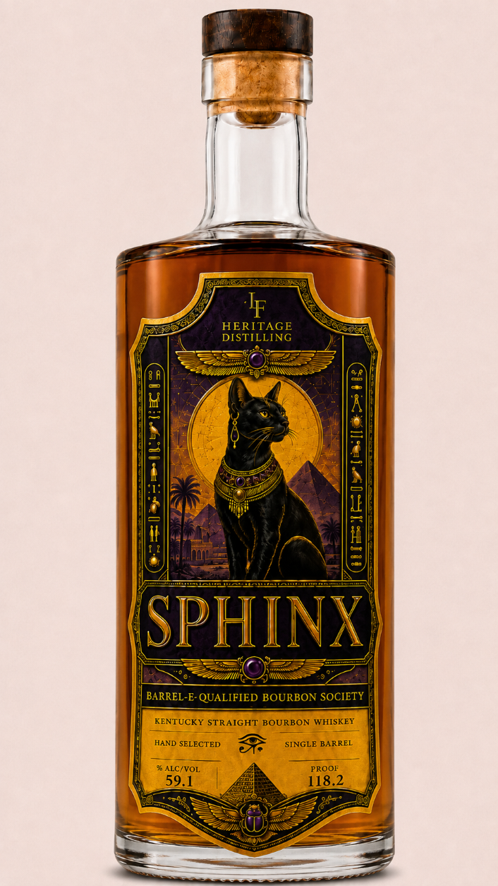
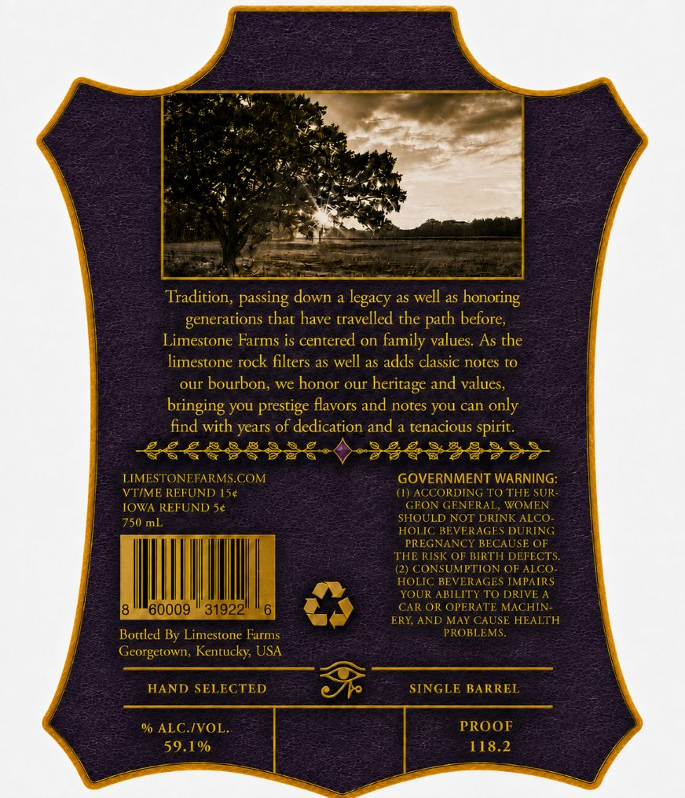

# TTB COLA Label Images - TTBID 26219001000106

**Brand Name:** SPHINX

**Fanciful Name:** LF HERITAGE DISTILLING

**Issue Date:** 08/13/2026

**Origin Code:** 22

**Product Class/Type:** 101

**Source:** [TTB Public COLA Registry](https://ttbonline.gov/colasonline/viewColaDetails.do?action=publicFormDisplay&ttbid=26219001000106)

## Label Images

### Front Label

### Label 2

## Extracted Label Text

*Text extracted via OCR - may contain errors*

**Detected Proof:** 118.2

### Front Label

F
HERITAGE
DISTILLING
4
1
7
1
SPHINX
BARREL-E- QUALIFIED BOURBON SOCIETY
KENTUCKY STRAIGHT BOURBON
WHISKEY
HAND SELECTED
SINGLE BARREL
% ALC/VOL
PROOF
59.1
118.2
Zae

### Label 2

Tradition, passing down a
as well as
generations that have travelled the
before;
Limestone Farms is centered on family values. As the
limestone rock filters
well as adds classic notes t0
our
bourbon, we honor our
heritage and values,
bringing You prestige flavors and notes YOU can only
find with years of dedication and a tenacious spirit.
2€ €988 3 @
LIMESTONEFARMS.COM
GOVERNMENT WARNING:
VTIME REFUND 154
(I) ACCORDING TO THE SUR
IOWA REFUND 5c
GEON GENERAL; WOMEN
750 mL
SHOULD NOT DRINK ALCO
HOLIC BEVERAGES DURING
PREGNANCY BECAUSE OF
THE RISK OF BIRTH DEFECTS;
(2) CONSUMPTION OF ALCO
HOLIC BEVERAGES IMPAIRS
YOUR ABILITT TO DRIVE A
'60009
319221
CAR OR OPERATE MACHIN-
ERY; AND MAY CAUSE HEALTH
Bottled By Limestone Farms
PROBLEMS
Georgetown , Kentucky; USA
HAND SELECTED
SINGLE BARREL
% ALC IVOL
PROOF
59.1%
118.2
legacy,
honoring
path
