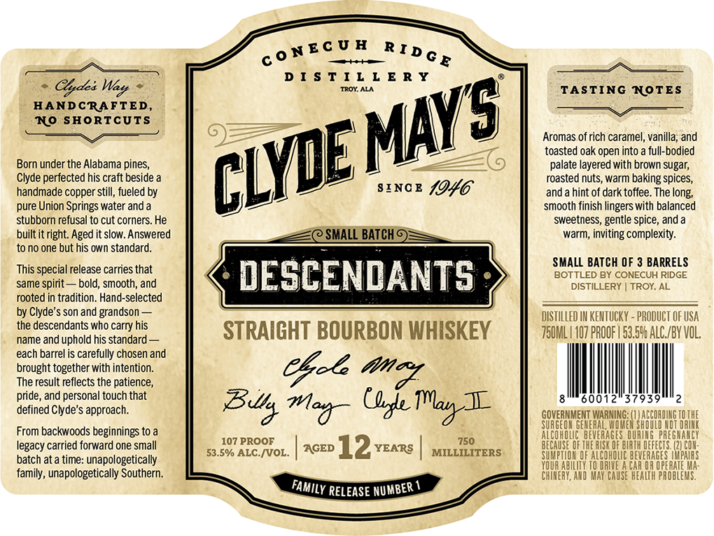

# TTB COLA Label Images - TTBID 26219001000194

**Brand Name:** CLYDE MAY'S

**Issue Date:** 08/13/2026

**Origin Code:** 10

**Product Class/Type:** 101

**Source:** [TTB Public COLA Registry](https://ttbonline.gov/colasonline/viewColaDetails.do?action=publicFormDisplay&ttbid=26219001000194)

## Label Images

### Label 1

### Label 2

## Extracted Label Text

*Text extracted via OCR - may contain errors*

*1 image(s) excluded: text did not meet readability threshold*

**Detected Proof:** 107
**Detected Age:** 12 Years

### Label 1

D I $ T I L L E R Y
Clyde:
TROY ALA
TASTING NOTES
HANDCRAFTED
No SHORTCUTS
Aromas of rich caramel, vanilla; and
toasted oak open into
full-bodied
Born under the Alabama pines_
palate layered with brown sugar;
Clyde perfected his craft beside
roasted nuts, warm baking spices;
handmade copper still;, fueled by
SINC B
1946
and a hint of dark toffee. The long;
pure Union Springs water and a
smooth finish lingers with balanced
stubborn refusal to cut corners. He
sweetness
spice, and a
built itright: Aged it slow: Answered
SMALL BATCH
warm; inviting complexity:
to no one but his own standard.
SMALL BATCH OF 3 BARRELS
This special release carries that
DESCENDANTS
BOTTLED BY CONECUH RIDGE
same spirit
bold; smooth, and
DISTILLERY
TROY; AL
rooted in tradition: Hand-selected
by Clyde's son and grandson
DISTILLED IN KENTUCKY - PRODUCT OF USA
the descendants who carry his
STRAIGHT BOURBON WHISKEY
750ML | 407 PROOF | 53.596 AlC /BY VOL,
name and uphold his standard
each barrel is carefully chosen and
brought together with intention.
Cboe
The result reflects the patience,
pride, and personal touch that
I
60012
37939
defined Clyde's approach.
GOVERNMENT
SURGEOH
ERAL,
EHARMHREUUHDEABHUG HRHHE
From backwoods beginnings to a
ALCoHOLIC ' BEVERAGES DURING`PREGHA
legacy carried forward one small
107 PROOF
AGED
12
YEARS
750
BECAUSE OF =
ASK OF BUR
defects
COU
batch ata time: unapologetically
53.5%/ ALC NVOL.
MILLILITERS
ALCOHOLIC BEVERAGES
PAIAS
CAR QR OPERATE
family, unapologetically Southern.
CauSe HEALTH PROBLEMS;
RELEASE
0 NEC U H
R ID G E
Wayt
MAYS
CLYE
gentle -
amd
BUs
C&c
 MlavX
Mod
FAMILY
NUMBER
