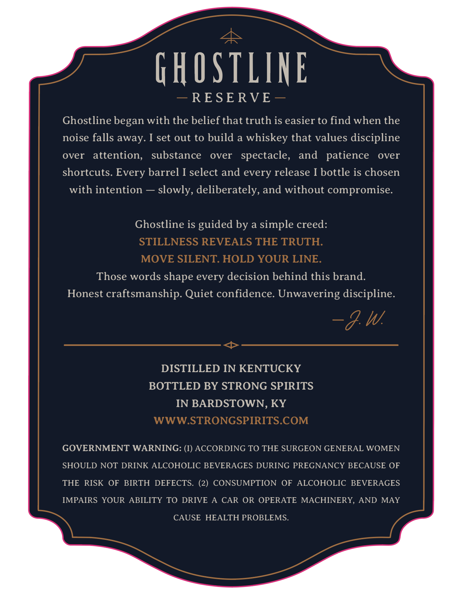
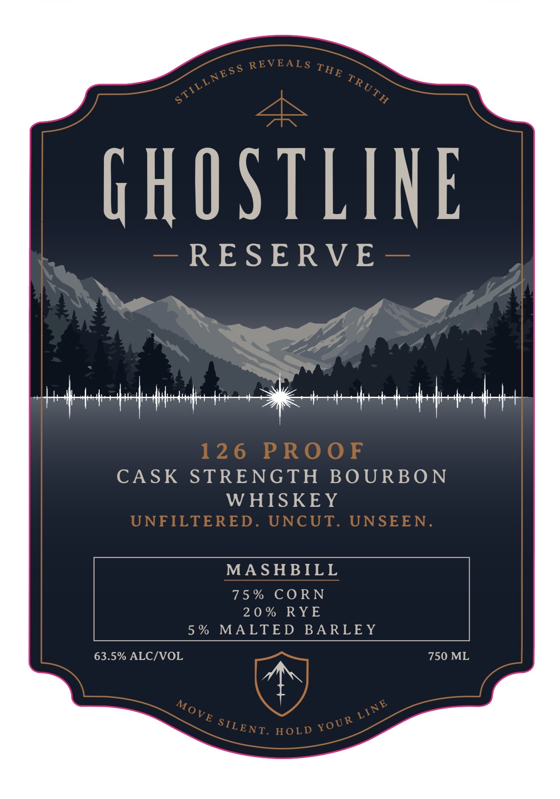

# TTB COLA Label Images - TTBID 26219001000212

**Brand Name:** GHOSTLINE RESERVE

**Issue Date:** 08/14/2026

**Origin Code:** 22

**Product Class/Type:** 141

**Source:** [TTB Public COLA Registry](https://ttbonline.gov/colasonline/viewColaDetails.do?action=publicFormDisplay&ttbid=26219001000212)

## Label Images

### Back Label

### Front Label

## Extracted Label Text

*Text extracted via OCR - may contain errors*

**Detected Proof:** 150

### Back Label

GHOSTLINE
RESE RVE
Ghostline began with the belief that truth is easier to find when the
noise falls away. I set out to build a whiskey that values discipline
over
attention,
substance
over
spectacle,
and
patience
over
shortcuts. Every barrel I select and every release I bottle is chosen
with intention
slowly, deliberately, and without compromise.
Ghostline is
guided by a simple creed:
STILLNESS REVEALS THE TRUTH:
MOVE SILENT: HOLD YOUR LINE.
Those words shape every decision behind this brand.
Honest craftsmanship. Quiet confidence: Unwavering discipline:
~&W
DISTILLED IN KENTUCKY
BOTTLED BY STRONG SPIRITS
IN BARDSTOWN, KY
WWWSTRONGSPIRITS.COM
GOVERNMENT WARNING: (I) ACCORDING TO THE SURGEON GENERAL WOMEN
SHOULD NOT DRINK ALCOHOLIC BEVERAGES DURING PREGNANCY BECAUSE OF
THE
RISK
OF
BIRTH DEFECTS. (2) CONSUMPTION
OF
ALCOHOLIC BEVERAGES
IMPAIRS YOUR ABILITY
TO DRIVE
CAR OR OPERATE MACHINERY,
AND
MAY
CAUSE HEALTH PROBLEMS.

### Front Label

HOSTLINE

RESERVE

che eet hth Sit pert

CASK STRENGTH BOURBON

WHISKEY

MASHBILL

75%

CORN

20%

ROVE:

5%

MALTED BARLEY

63.5% ALC/VOL

750 ML

ey
