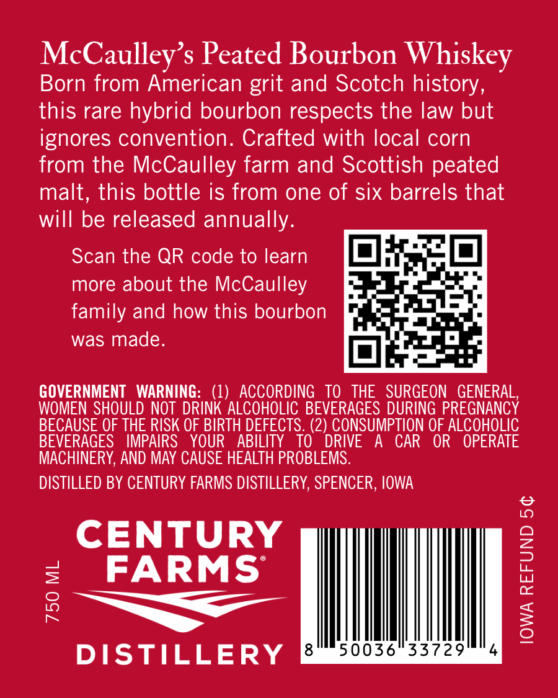
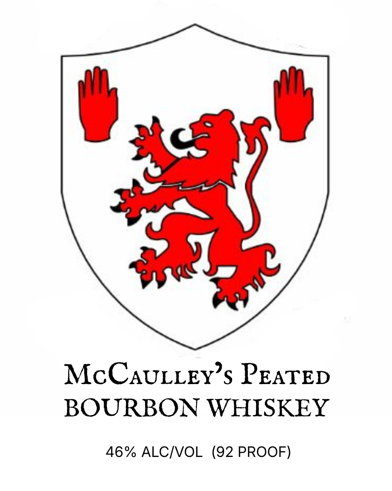

# TTB COLA Label Images - TTBID 26219001000286

**Brand Name:** MCCAULLEY'S PEATED

**Issue Date:** 08/17/2026

**Origin Code:** 20

**Product Class/Type:** 141

**Source:** [TTB Public COLA Registry](https://ttbonline.gov/colasonline/viewColaDetails.do?action=publicFormDisplay&ttbid=26219001000286)

## Label Images

### Back Label

### Front Label

## Extracted Label Text

*Text extracted via OCR - may contain errors*

**Detected Proof:** 92

### Back Label

McCaulley’s Peated Bourbon Whiskey
Born from American grit and Scotch history,
this rare hybrid bourbon respects the law but
ignores convention. Crafted with local corn
from the McCaulley farm and Scottish peated
malt, this bottle is from one of six barrels that
will be released annually.

Scan the QR code to learn
more about the McCaulley
family and how this bourbon
was made.

GOVERNMENT WARNING: (1) ACCORDING TO THE SURGEON GENERAL,
WOMEN SHOULD NOT DRINK ALCOHOLIC BEVERAGES DURING PREGNANCY
BECAUSE OF THE RISK OF BIRTH DEFECTS. (2) CONSUMPTION OF ALCOHOLIC
BEVERAGES IMPAIRS YOUR ABILITY TO DRIVE A CAR OR OPERATE
MACHINERY, AND MAY CAUSE HEALTH PROBLEMS.

DISTILLED BY CENTURY FARMS DISTILLERY, SPENCER, IOWA

CENTURY
FARMS
Ts
DISTILLERY

750 ML

IOWA REFUND 5¢

### Front Label

McCAULLEY s PEATED
BOURBON WHISKEY
46% ALCIVOL (92 PROOF)
