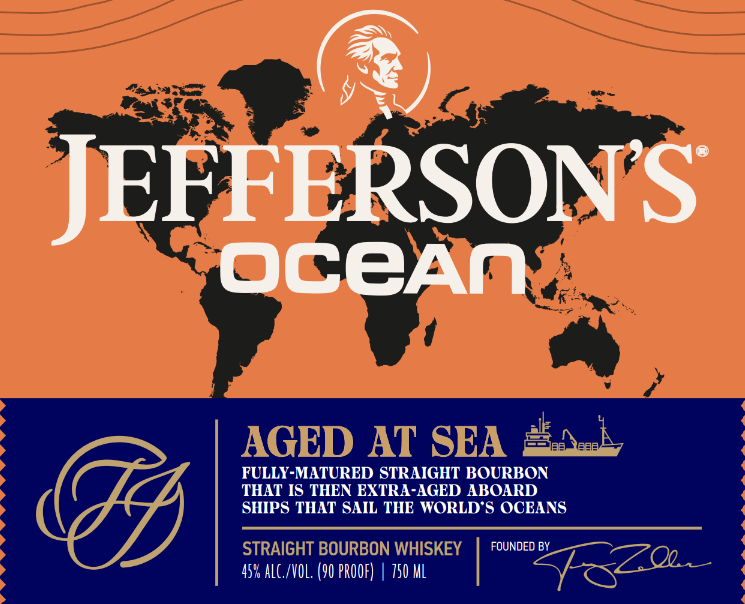
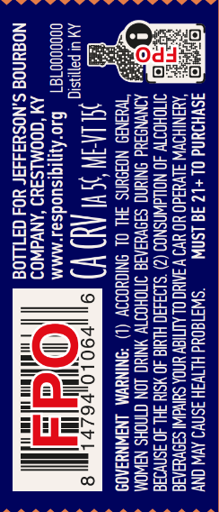
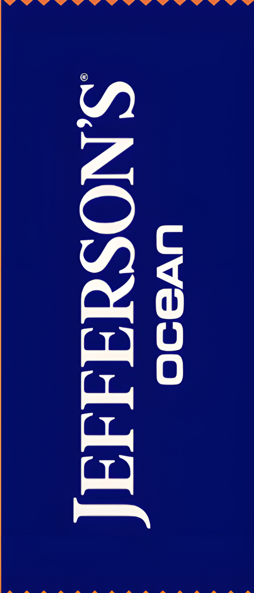

# TTB COLA Label Images - TTBID 26219001000315

**Brand Name:** JEFFERSON'S

**Fanciful Name:** OCEAN VOYAGE 37

**Issue Date:** 08/26/2026

**Origin Code:** 22

**Product Class/Type:** 101

**Source:** [TTB Public COLA Registry](https://ttbonline.gov/colasonline/viewColaDetails.do?action=publicFormDisplay&ttbid=26219001000315)

## Label Images

### Front Label

### Label 2

### Label 3

### Label 4

## Extracted Label Text

*Text extracted via OCR - may contain errors*

*1 image(s) excluded: text did not meet readability threshold*

**Detected Proof:** 90

### Front Label

JEFFERSONS
OCEAn
AGED AT SEA
FULLY-MATURED STRAIGHT BOURBON
THAT IS THEN EXTRA-AGED ABOARD
SHIPS THAT SAIL THE WORLD) S OCEANS
STRAIGHT BOURBON WHISKEY
FOUNDEQ BY
45% alC /VOL: (90 PROOF)
750 ML

### Label 2

AAAS AASAASASASNASAS SSNS SSS SS SESS SS
Of. O|
Bian
Fa, a
meee
obs
AAA AAA AAAS AAAS ASS A  T S >>
De

### Label 3

ASVHIUNd OL+12 IG LSAW — “SWIT80Ud HLIVSH ASN AVW ONY
‘AHANIHOWW SUVUSd0 YO UV V AAMC OL ALTIGY UNDA SUNWI SB9VeaS
‘SMOHOTTV 40 NOLdWNSNOO (2) ’S193430 HLUIG 40 YSIY 3HL 40 ASNVIa
AONYNDSUd ONIUNG SIOVUIARG ITICHOTTV YNING LON CINOHS NAWOM
3HL OL SNIGUOISY (L) ‘SNINUWM LNJWNYIA09

cooog007a1 ‘MMM
AM ‘COOMLS3YD ‘ANVAWOD
NO@uNOd S.NOSHI444r YO4 GF1LLO8
