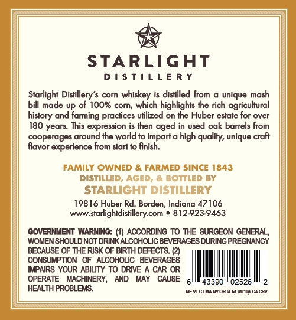
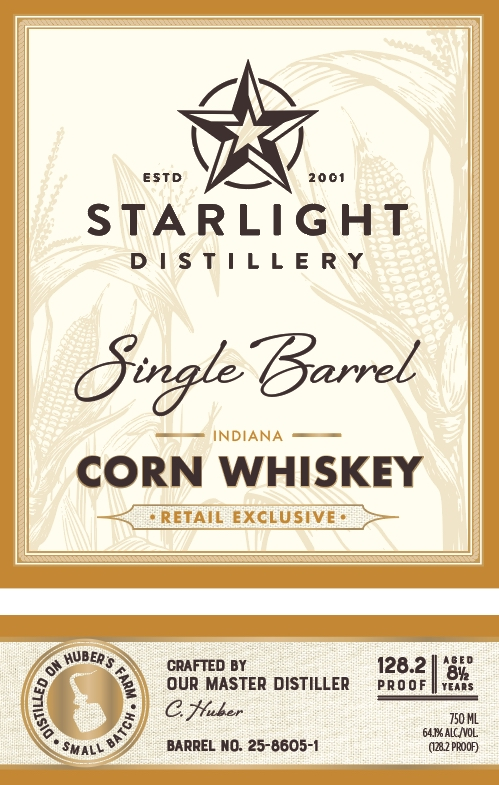

# TTB COLA Label Images - TTBID 26219001000479

**Brand Name:** STARLIGHT DISTILLERY

**Fanciful Name:** SINGLE BARREL

**Issue Date:** 08/14/2026

**Origin Code:** 19

**Product Class/Type:** 143

**Source:** [TTB Public COLA Registry](https://ttbonline.gov/colasonline/viewColaDetails.do?action=publicFormDisplay&ttbid=26219001000479)

## Label Images

### Back Label

### Front Label

## Extracted Label Text

*Text extracted via OCR - may contain errors*

**Detected Proof:** 128.2

### Back Label

STARLIGHT
D ! $ T |  L E R Y
Starlight Distillery's corn whiskey is distilled from
unique mash
bill made UP of 10O% corn; which highlights the rich agricultural
and
practices utilized on the Huber estate for over
180 years This expression is then aged in used oak barrels From
cooperages around the world to impart a
high quality; unique craft
Alavor experience from start to finish.
FAMILY OWNED & FARMED SINCE 1843
DISTILLED, AGED, & BOTTLED BY
STARLIGHT DISTILLERY
19816 Huber Rd:. Borden, Indiana 47106
wwwstarlightdistillery com
812923-9463
GOVERNMENT WARNING:
ACCORDING TO THE SURGEON GENERAL
WOMENSHOULD NOT DRINK ALCOHOLIC BEVERAGES DURING PREGNANCY
BECAUSE OF THE RISK OF BIRTH DEFECT8. (2)
CONSUMPTION
ALCOHOLIC   BEVERAGES
IMPAIRS YOUR ABILTY TO DRIE A CAR OR
OPERATE   MACHINERY,
AND
MAY
CAUSE
43390
02526
HEALTH PROBLEMS
MEYT CTMA Ny-Or4 & MHC CAcRV
farming
history

### Front Label

ESTD
2001
STARLIGHT
D | $ T | L L E R Y
Gwrgle Barrel
INDIANA
CORN WHISKEY
RETAIL EXCLUSIVE
JER $
CRAFTED BY
128.2
ouR MASTER DISTILLER
PRo 0F
2
C Huler
750 ML
64.1% ALC IVOL
SmaLL
BARREL NO: 25-8605-1
(128.2 PRDOR)
hube
1
1
