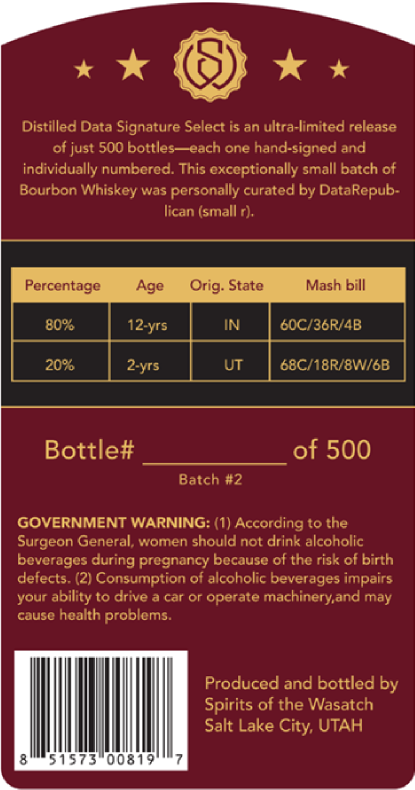
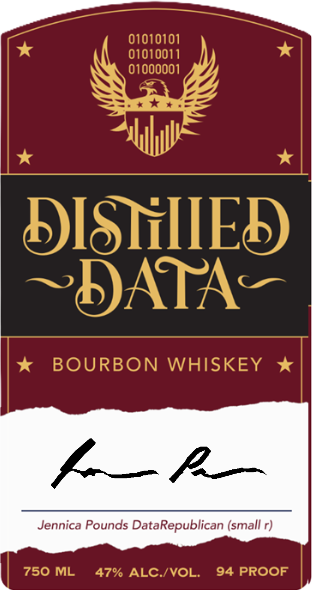

# TTB COLA Label Images - TTBID 26219001000501

**Brand Name:** DISTILLED DATA

**Issue Date:** 08/14/2026

**Origin Code:** 45

**Product Class/Type:** 141

**Source:** [TTB Public COLA Registry](https://ttbonline.gov/colasonline/viewColaDetails.do?action=publicFormDisplay&ttbid=26219001000501)

## Label Images

### Back Label

### Front Label

### Label 3

## Extracted Label Text

*Text extracted via OCR - may contain errors*

*1 image(s) excluded: text did not meet readability threshold*

**Detected Proof:** 94

### Back Label

Distilled Data Signature Select is an ultra-limited release
of just 500 bottles each one hand-signed and
individually numbered: This exceptionally small batch of
Bourbon
Whiskey was personally curated by DataRepub-
lican (small r)
Percentage
Age
Orig: State
Mash bill
8096
IN
6OC/36RI4B
2096
UT
68C/18R/8W/GB
Bottle#
of 500
Batch #2
GOVERNMENT WARNING: (1) According to the
Surgeon General, women should not drink alcoholic
beverages during pregnancy because of the risk of birth
defects. (2) Consumption of alcoholic beverages impairs
your
ability to drive a car or operate machinery,and may
cause health problems.
Produced and bottled by
Spirits of the Wasatch
Salt Lake
UTAH
51573"00819
12-yrs
2-yrs
City;

### Front Label

01010101
01010011
01000001
DISTHIIED
DATA
BOURBON
WHISKEY
L_P
Jennica Pounds DataRepublican (small r)
750 ML
47% ALC /VOL:
94 PROOF
