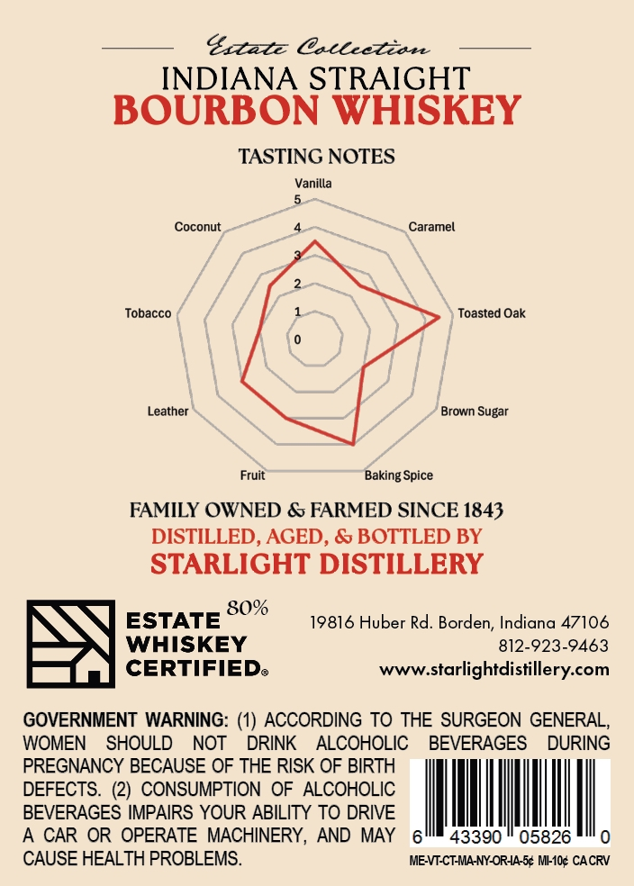
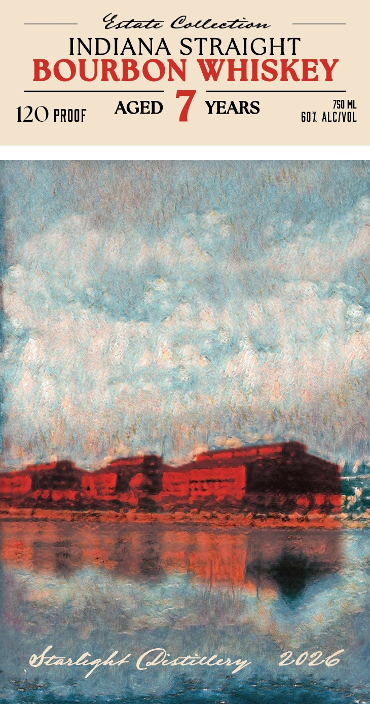

# TTB COLA Label Images - TTBID 26219001000580

**Brand Name:** STARLIGHT DISTILLERY

**Issue Date:** 08/14/2026

**Origin Code:** 19

**Product Class/Type:** 101

**Source:** [TTB Public COLA Registry](https://ttbonline.gov/colasonline/viewColaDetails.do?action=publicFormDisplay&ttbid=26219001000580)

## Label Images

### Back Label

### Front Label

## Extracted Label Text

*Text extracted via OCR - may contain errors*

**Detected Proof:** 80
**Detected Age:** 7 Years

### Back Label

Extazz @aleetian
INDIANA STRAIGHT
BOURBON WHISKEY
TASTING NOTES
Vanilla
Coconut
Caramel
Tobacco
Toasted Oak
Leather
Brown Sugar
Fruit
Baking Spice
FAMILY OWNED & FARMED SINCE 1843
DISTILLED, AGED , & BOTTLED BY
STARLIGHT DISTILLERY
80%
ESTATE
19816 Huber Rd. Borden; Indiana 47106
WHISKEY
812-923-9463
CERTIFIEDe
WWw.starlightdistillery com
GOVERNMENT WARNING: (1) ACCORDING TO THE SURGEON GENERAL
WOMEN
SHOULD
NOT
DRINK
ALCOHOLIC
BEVERAGES
DURING
PREGNANCY BECAUSE OF THE RISK OF BIRTH
DEFECTS_
(2)
CONSUMPTION
OF ALCOHOLIC
BEVERAGES IMPAIRS YOUR ABILITY TO DRIVE
A CAR OR OPERATE MACHINERY,
AND
MAY
43390
05826
CAUSE HEALTH PROBLEMS_
MBVTCTMA-NY-ORIA-5c MI-AOc CACRV

### Front Label

SS eee Cet
INDIANA STRAIGHT
BOURBON WHISKEY

120 prop AGED 7 YEARS S01 ALLIVOL
