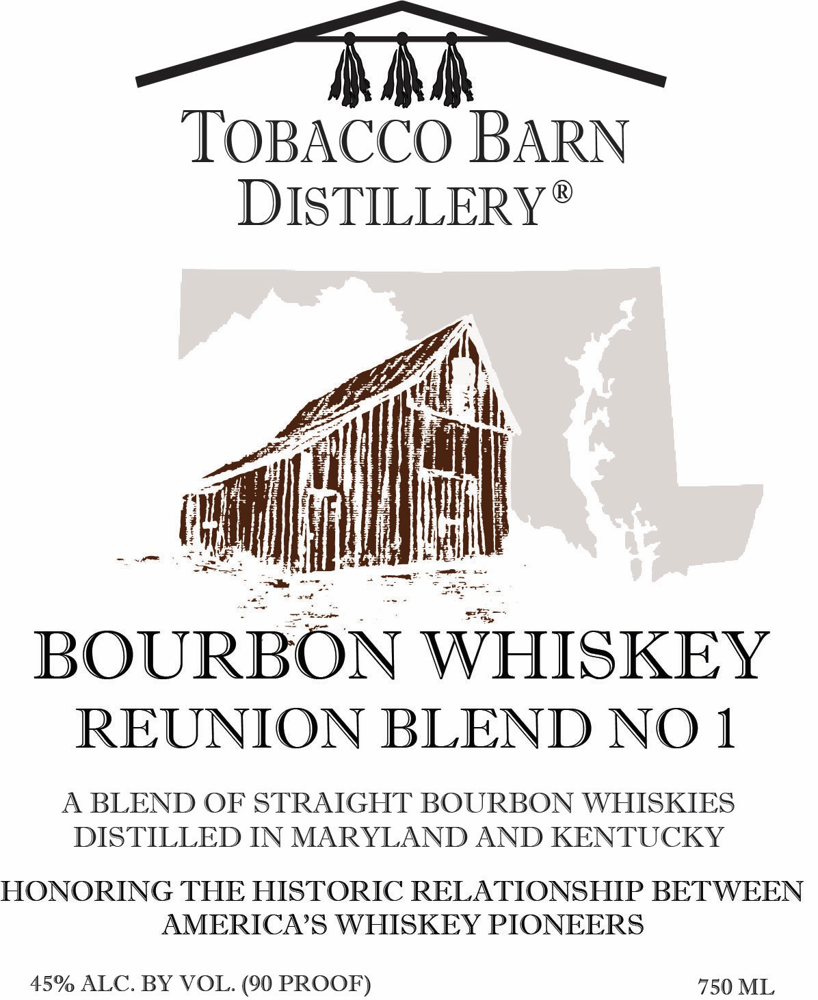
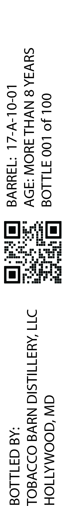
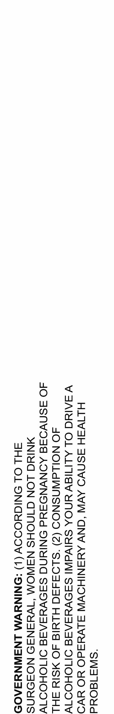

# TTB COLA Label Images - TTBID 26221001000036

**Brand Name:** TOBACCO BARN DISTILLERY

**Issue Date:** 09/02/2026

**Origin Code:** 25

**Product Class/Type:** 141

**Source:** [TTB Public COLA Registry](https://ttbonline.gov/colasonline/viewColaDetails.do?action=publicFormDisplay&ttbid=26221001000036)

## Label Images

### Front Label

### Label 2

### Label 3

## Extracted Label Text

*Text extracted via OCR - may contain errors*

**Detected Proof:** 90

### Front Label

— tht —

TOBACCO BARN
DISTILLERY*®

NIE) e
aait
hee ij rh

2 pasa
sil eee Le

BOURBON WHISKEY
REUNION BLEND NO 1

A BLEND OF STRAIGHT BOURBON WHISKIES
DISTILLED IN MARYLAND AND KENTUCKY

HONORING THE HISTORIC RELATIONSHIP BETWEEN
AMERICA’S WHISKEY PIONEERS

45% ALC. BY VOL. (90 PROOF) 750 ML

### Label 2

CW ‘GOOMATIOH
DTT AYATILSIC NYVd ODDVEOL
‘Ad G41LLO”

001 JO LOO JILLOS [=]
SYVIA8NVHLIYOW “dDV
LO-OL-v-ZL ‘TauYuvd [ee

### Label 3

‘SW31g0ud

HLIWAH ASNVO AVI ‘GNV AYMANIHOVI SLVeSadO YO YVO

V AAING OL ALIMNIEGV HNOA SHIVdWI SADVYSARE OMOHOO1V
4O NOILAUWNSNOD (Z) “S1LO34350 HLYIG 4O MSIY SHL

dO ASNVOAE AONVND Add ONIN SSADVYSAR OMOHOO1V
MNING LON GINOHS NSWOM “IWYSaN39 NOSZ9yYNS

FHL OL ONIGHOOOV (L) “DNINYWM LNSINNNYSAOD
