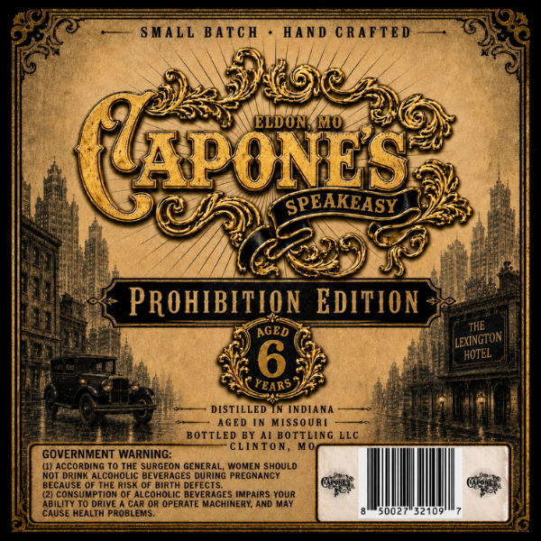
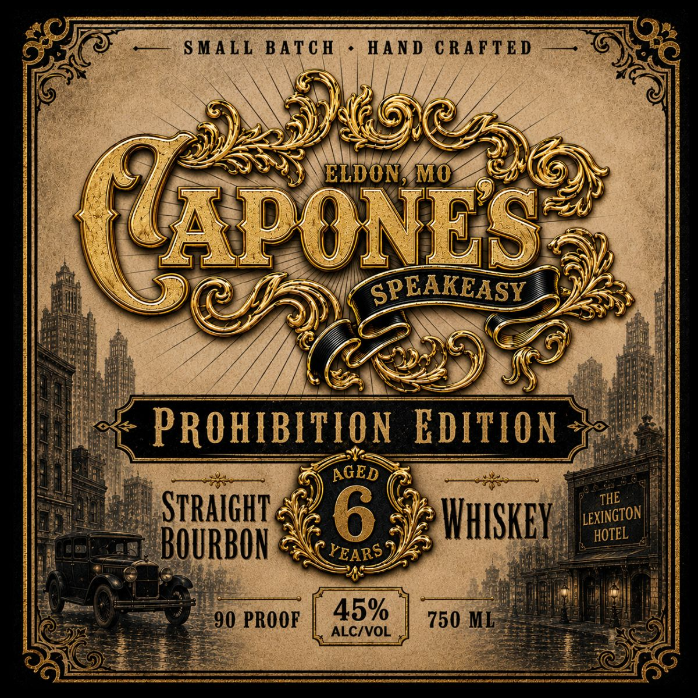

# TTB COLA Label Images - TTBID 26222001000011

**Brand Name:** CAPONE'S

**Issue Date:** 08/17/2026

**Origin Code:** 29

**Product Class/Type:** 101

**Source:** [TTB Public COLA Registry](https://ttbonline.gov/colasonline/viewColaDetails.do?action=publicFormDisplay&ttbid=26222001000011)

## Label Images

### Back Label

### Front Label

## Extracted Label Text

*Text extracted via OCR - may contain errors*

**Detected Proof:** 90

### Back Label

S MALL BATc H
HAnd C RAFTED
ELDONGMMO
(APoNEs
SPEAKEASY
PROHIBITION EDITION
THE
AGED
6
HOTEL
YEARS
DISTILLED
INDIANA
AGED In MISSOUR
BOTTLED By AI BottlinG LLc
CLINTON_
GOVERNMENT WARNING:
(1) According Io Ihe Surgeon GENERAL' Womem SHOULD
NoT Drink ALcOHOLiC BEVERAGES DURINg PREGNANCY
BECAUSE OF THE Risk 0F Birth DEFECTS_
(2) consuMPTIOn 0f AlcOhOLIC BEVERAGES IMPAIRS YOUR
ABILITY
TOrnpiVI
car Or OPERATE MAchineRY, AND MaY
CAUSE HEALTH PROBLEMS.
LExINGTONI

### Front Label

SMALL
BATC H
HAND
CRAFTED
ELDON;
MO
(UAPONES
SPEAKEASY
PROHIBITION EDITION
AGED
STRAIGHT
6
WhKSKEy
BOURBON
YEARS
90 PROOF
45%
750 ML
ALCIVOL
THE
ILEXINGTON |
HOTEL
