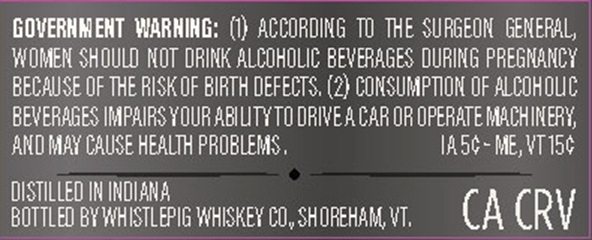

# TTB COLA Label Images - TTBID 26222001000090

**Brand Name:** WHISTLEPIG

**Issue Date:** 09/09/2026

**Origin Code:** 46

**Product Class/Type:** 142

**Source:** [TTB Public COLA Registry](https://ttbonline.gov/colasonline/viewColaDetails.do?action=publicFormDisplay&ttbid=26222001000090)

## Label Images

### Back Label

### Front Label

## Extracted Label Text

*Text extracted via OCR - may contain errors*

**Detected Proof:** 110

### Back Label

GOVERNMEHT  WARHIHG: (1} ACCORDING TO ThE SURGEON   GENERAL,
WOMEN ShOULD NOT DRINK ALCOhOLIC: BeveRAGES DURING PREGNANCY
BECAUSE OF THE RISK OF BIRTH DEFECTS. (2} CONSUMPTION OF alcohoUC
BEVERAGES IMPAIRS YOUR AbLLTYTO DRIVEA CAR OR OPERATE MACHINERY
And May CAUSE health PROBLEMS ,
IA5c- ME, VT 150
distILLeD IN INDIANA
Bottled BY WHISTLEPIG WHISKEY CO , SHOREHAM VT;
CA CRV

### Front Label

PICGYRANK RYE
110
55 %
PROOF
IL
LIMITED EITION
ALCIVOL
TOASTED
BARREL
RYE
WHISKEY
