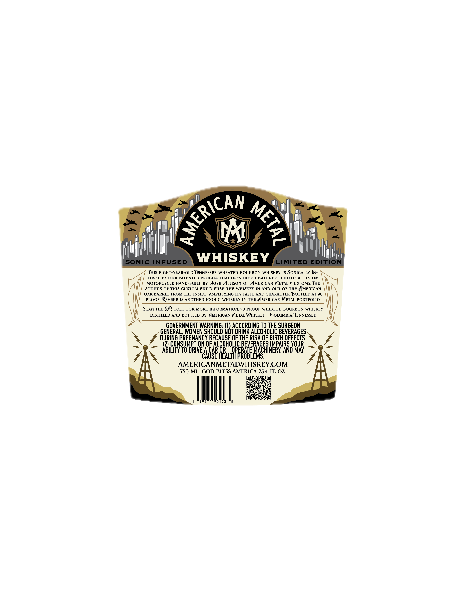
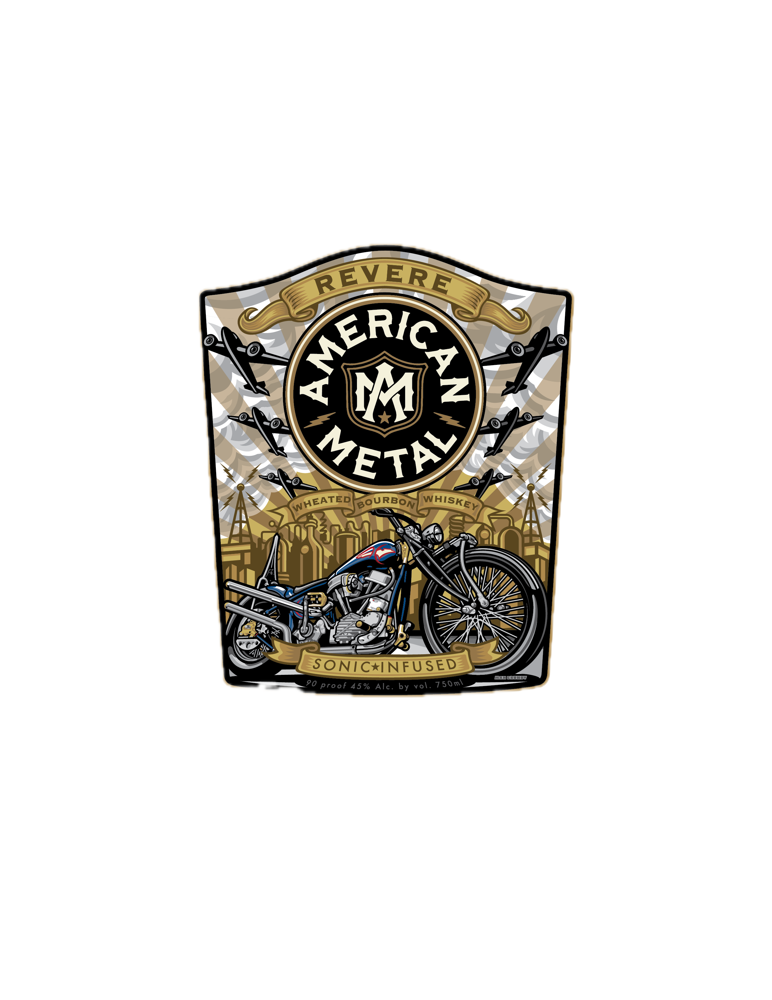
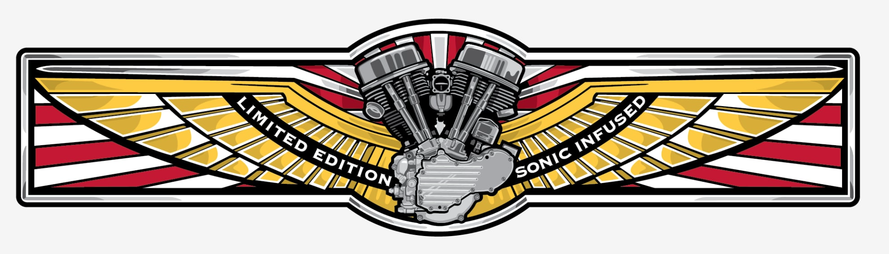

# TTB COLA Label Images - TTBID 26222001000156

**Brand Name:** AMERICAN METAL

**Issue Date:** 09/23/2026

**Origin Code:** 43

**Product Class/Type:** 141

**Source:** [TTB Public COLA Registry](https://ttbonline.gov/colasonline/viewColaDetails.do?action=publicFormDisplay&ttbid=26222001000156)

## Label Images

### Back Label

### Front Label

### Label 2

## Extracted Label Text

*Text extracted via OCR - may contain errors*

*1 image(s) excluded: text did not meet readability threshold*

**Detected Proof:** 90

### Back Label

M
SONIC INFUSED
WHISKEY
LIMITED EDITION
THIS EIGHT-YEAR-OLD TENNESSEE WHEATED BOURBON WHISKEY IS SONICALLY IN
FUSED BY OUR PATENTED PROCESS THAT USES THE SIGNATURE SOUND OF A CUSTOM
MOTORCYCLE
HAND-BUILT BY eoSH ALLISON OF JMERICAN METAL GUSTOMs THE
SOUNDS OF THIS CUSTOM BUILD PUSH THE WHISKEY IN AND OUT OF THE JMERICAN
OAK BARREL FROM THE INSIDE, AMPLIFYING ITS TASTE AND CHARACTER BOTTLED AT 90
PROOF, REVERE IS ANOTHER ICONIC WHISKEY IN THE JMERICAN METAL PORTFOLIO.
SCAN THE QR CODE FOR MORE INFORMATION 90 PROOF WHEATED BOURBON WHISKEY
DISTILLED AND BOTTLED BY JMERICAN METAL WHISKEY
GOLUMBIA TENNESSEE
GOVERNMENT WARNING: (U) ACCORDING TO THE SURGEON
GENERAL
WOMEN SHOULD NOT DRINK ALCOHOLIC BEVERAGES
DURING PREGNANCY BECAUSE OF THE RISK OF BIRTH DEFECTS:
(2) CONSUMPTION OF ALCOHOLIC BEVERAGES IMPAIRS YOUR
ABILITY TO DRIVE A CAR OR
OPERATE MACHINERY, AND MAY
CAUSE HEALTH PROBLEMS:
AMERICANMETALWHISKEY.COM
750 ML
GOD BLESS AMERICA 25.4 FL OZ
99874"96153
PMERICAN
3

### Front Label

REVERE
4
W
BouRBON
SONIC*INFUSED
ILLICLLI
90 proof 45 %
Alc . by vol . 750ml
@r1
GETAY
WHISKEY
WHEATED
