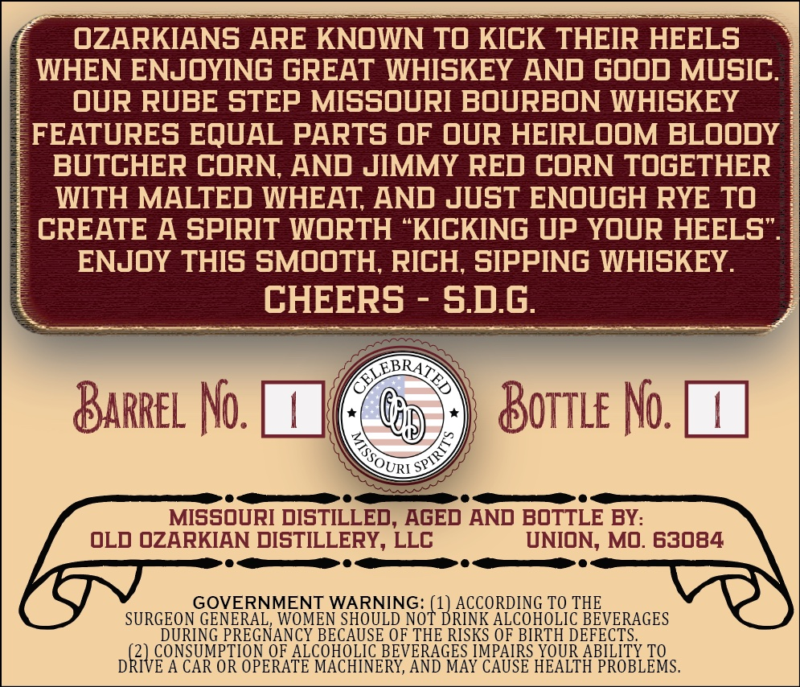
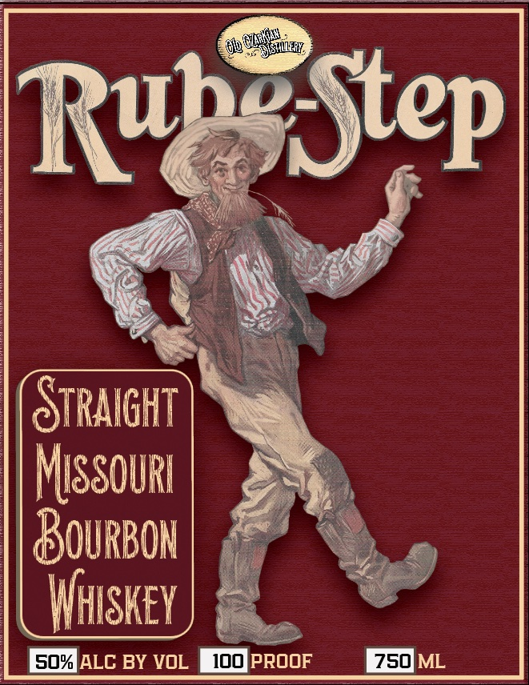

# TTB COLA Label Images - TTBID 26222001000215

**Brand Name:** OLD OZARKIAN DISTILLERY

**Fanciful Name:** RUBE-STEP STRAIGHT MISSOURI BOURBON WHISKEY

**Issue Date:** 08/20/2026

**Origin Code:** 29

**Product Class/Type:** 141

**Source:** [TTB Public COLA Registry](https://ttbonline.gov/colasonline/viewColaDetails.do?action=publicFormDisplay&ttbid=26222001000215)

## Label Images

### Back Label

### Front Label

## Extracted Label Text

*Text extracted via OCR - may contain errors*

### Back Label

OZARKIANS ARE KNOWN TO KICK THEIR HEELS
WHEN ENJOYING GREAT WHISKEY AND GOOD MUSIC.
ouR RUBE STEP Missouri BouRBON WHISKEY
FEATURES EQUAL PARTS OF ouR HEIRLoOM BLooDY
BUTCHER CORN, AND JIMMY RED CORN TOGETHER
WITH MALTED WHEAT; AND JuST ENouGH RYE TO
CREATE A SPIRIT WORTH
KICKING UP YOUR HEELS
ENJOY THIS SMOOTH, RICH, SIPPING WHISKEY.
CHEERS
sd.g;
KEBRA
BARREL No.
Bottle No.
MissouRI DISTILLEd, AgEd AND BOTTLE BY:
OLD OZARKIAN DISTILLERY, LLC
UNION, MO. 63084
GOVERNMENT WARNING; (1) ACCORDING TO THE
SURGEON GENERAL, WOMEN SHOULDNOT_DRINK ALCOHOLIC BEVERAGES
DURING PREGNANCY BECAUSE OF THE RISKS OF BIRTH DEFECTS
(2) CONSUMPTION OF ALCOHOLIC_BEVERAGES IMPAIRS YOUR ABILITY TO
DRIVE A CAR OR OPERATE MACHINERY, AND MAY CAUSE HEALTH PROBLEMS
3
1
SPIRT T
OURI

### Front Label

JISTLERE
RubStep]
Stralght
Missourl
BouRBon
Whiskey
sox ALC BY voL
1ooproof
750]ML
 Oxelw
