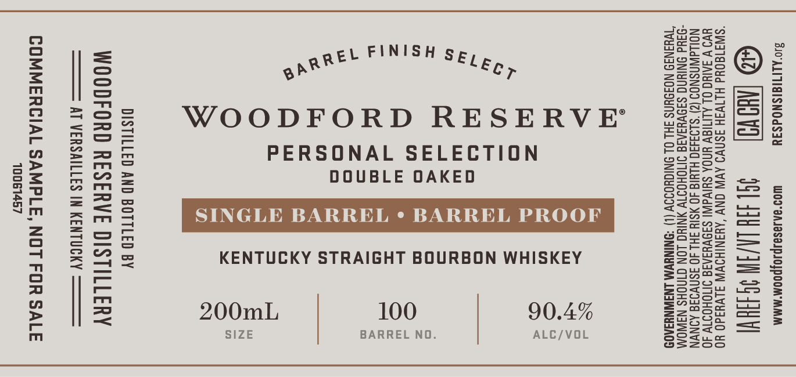

# TTB COLA Label Images - TTBID 26222001000278

**Brand Name:** WOODFORD RESERVE

**Fanciful Name:** DOUBLE OAKED PERSONAL SELECTION SINGLE BARREL

**Issue Date:** 08/25/2026

**Origin Code:** 22

**Product Class/Type:** 101

**Source:** [TTB Public COLA Registry](https://ttbonline.gov/colasonline/viewColaDetails.do?action=publicFormDisplay&ttbid=26222001000278)

## Label Images

### Front Label

## Extracted Label Text

*Text extracted via OCR - may contain errors*

**Detected Proof:** 90.4

### Front Label

qavozxaa

acaaeo

sss

oeZzsto

Gos,2

%

annet FINISH s¢, °

Zener

=e

|

S525

el ev oa

Ser

(aah ae ae

War

WOODFORD RESERVE

Zool

wees

eS

FSuan

Gcow

Pate?

PERSONAL SELECTION

2a=zf5

DOUBLE OAKED

ee

ant

SSuaoa

So2cas

“Ea

SINGLE BARREL ¢ BARREL PROOF

=2zn>

Bvoo

Sur

Zour

2

KENTUCKY STRAIGHT BOURBON WHISKEY

2555

ws

=o

SSS

25S

G=z35

Soasw

or

Snu

eps

200mL

100

90.4%

euRZCa

SIZE

BARREL NO.

ALC/VOL

HSSao

tuc

e=250
