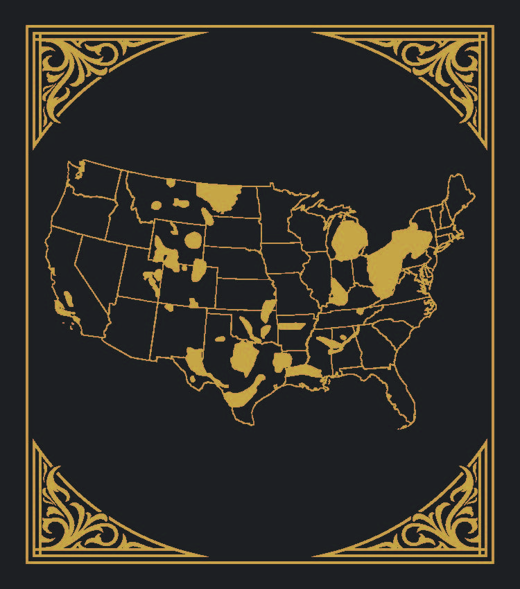
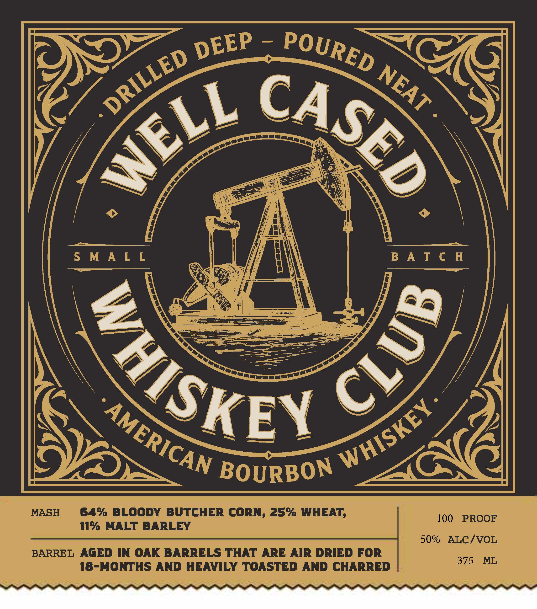

# TTB COLA Label Images - TTBID 26222001000281

**Brand Name:** WELL CASED WHISKEY CLUB

**Issue Date:** 08/20/2026

**Origin Code:** 39

**Product Class/Type:** 141

**Source:** [TTB Public COLA Registry](https://ttbonline.gov/colasonline/viewColaDetails.do?action=publicFormDisplay&ttbid=26222001000281)

## Label Images

### Back Label

### Front Label

## Extracted Label Text

*Text extracted via OCR - may contain errors*

**Detected Proof:** 100

### Back Label

> <
= roa neh
Rees “4
SORE
soe
iS ye

### Front Label

S
S M A L L
B A T € H
BOURBON
MASH
64% BLOODY BUTCHER CORN, 25% WHEAT;
100
PROOF
11% MALT BARLEY
50%
ALC/VOL
BARREL
AGED IN OAK BARRELS THAT ARE AIR DRIED FOR
375
ML
18-MONTHS AND HEAVILY TOASTED AND CHARRED
DEEP
POURED
DRILLED
NEAT
CASED
WELL
8
WhiSKE)
WHISKEY
AMERICAN
