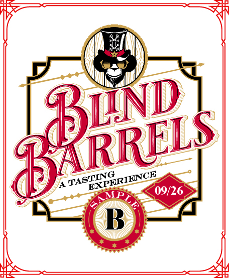
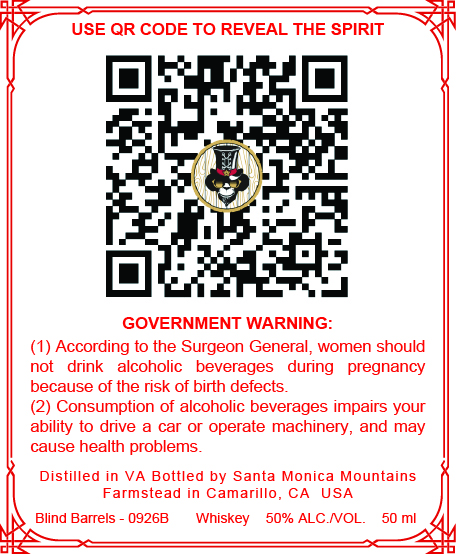

# TTB COLA Label Images - TTBID 26222001000326

**Brand Name:** BLIND BARRELS

**Issue Date:** 08/17/2026

**Origin Code:** 01

**Product Class/Type:** 140

**Source:** [TTB Public COLA Registry](https://ttbonline.gov/colasonline/viewColaDetails.do?action=publicFormDisplay&ttbid=26222001000326)

## Label Images

### Back Label

### Front Label

## Extracted Label Text

*Text extracted via OCR - may contain errors*

**Detected Proof:** 100

### Back Label

Bind
ICE
MP
09/26
B
BARRELS
TASTING
EXPERIEN

### Front Label

USE QR CODE TO REVEAL THE SPIRIT
GOVERNMENT WARNING:
According to the Surgeon General,
women should
not
drink
alcoholic
beverages
during
pregnancy
because of the risk of birth defects_
Consumption of alcoholic beverages impairs your
ability to drive a
car or operate machinery,
may
cause health problems_
Distilled in VA Bottled by Santa Monica Mountains
Farmstead
in Camarillo
CA
USA
Blind Barrels
0926B
Whiskey
50% ALC NOL:
50 mi
and
