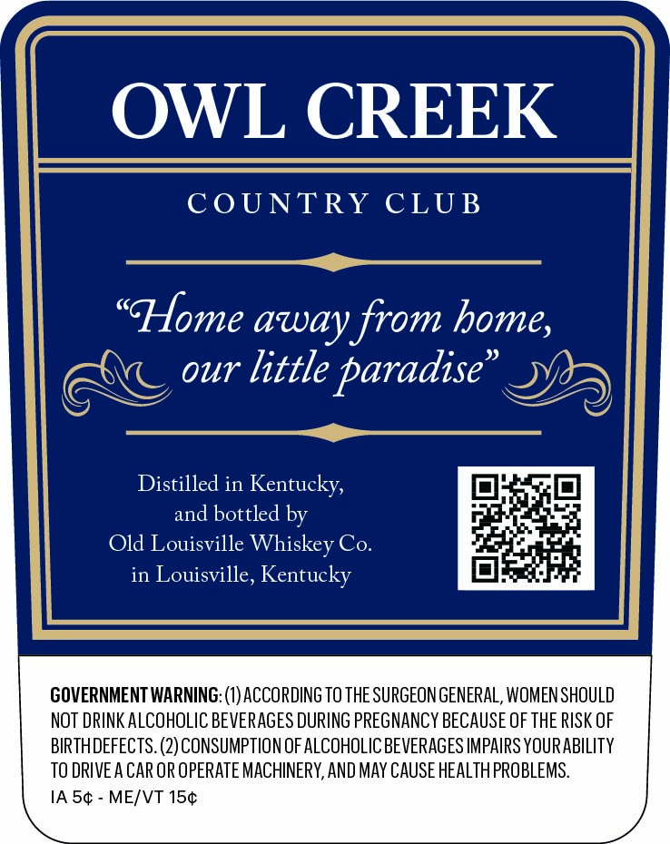
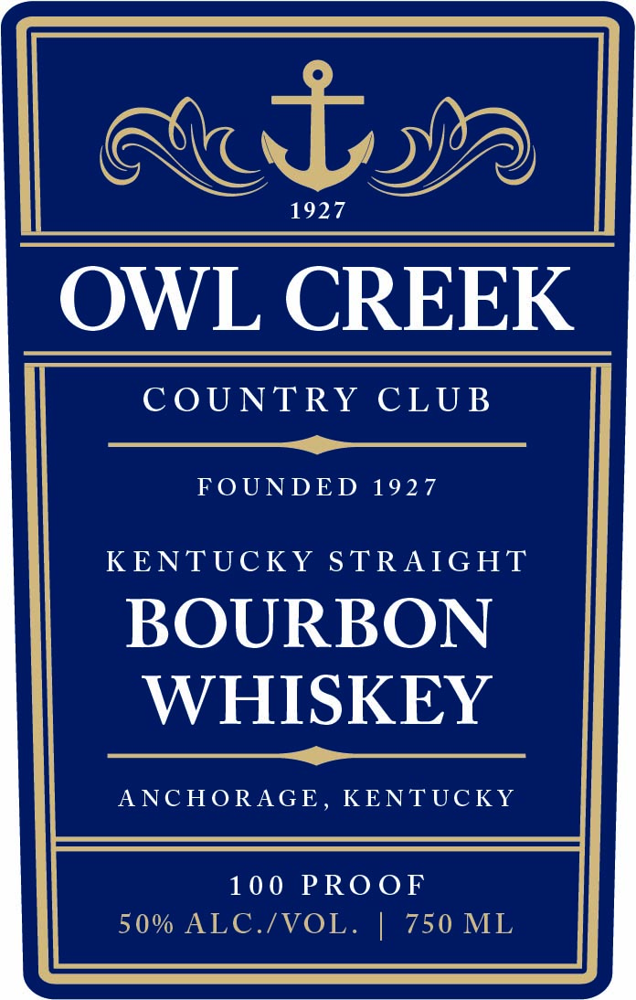

# TTB COLA Label Images - TTBID 26222001000410

**Brand Name:** OWL CREEK

**Issue Date:** 08/17/2026

**Origin Code:** 22

**Product Class/Type:** 101

**Source:** [TTB Public COLA Registry](https://ttbonline.gov/colasonline/viewColaDetails.do?action=publicFormDisplay&ttbid=26222001000410)

## Label Images

### Back Label

### Front Label

## Extracted Label Text

*Text extracted via OCR - may contain errors*

### Back Label

|| OWL CREEK _ |

| COUNTRY CLUB

“Home away from home, _ |j
: our little paradise” yy)
Jy =

1] Distilled in Kentucky,
and bottled by

il Old Louisville Whiskey Co.
in Louisville, Kentucky

GOVERNMENT WARNING: (1) ACCORDING TO THE SURGEON GENERAL, WOMEN SHOULD
NOT DRINK ALCOHOLIC BEVERAGES DURING PREGNANCY BECAUSE OF THE RISK OF
BIRTHDEFECTS. (2) CONSUMPTION OF ALCOHOLIC BEVERAGES IMPAIRS YOURABILITY

TO DRIVE A CAR OR OPERATE MACHINERY, AND MAY CAUSE HEALTH PROBLEMS.
1A 5¢ - ME/VT 15¢

### Front Label

Roby

OWL CREEK

COUNTRY CLUB

FOUNDED 1927

KENTUCKY STRAIGHT

BOURBON

WHISKEY

ANCHORAGE, KENTUCKY
