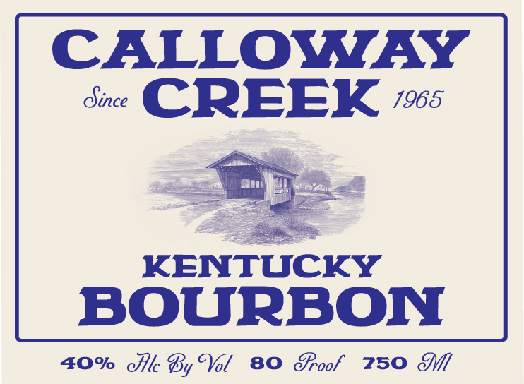
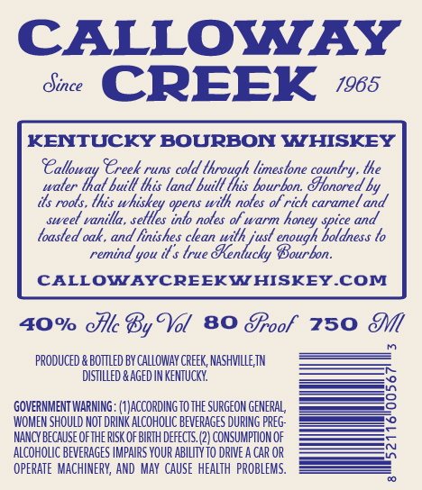

# TTB COLA Label Images - TTBID 26222001000462

**Brand Name:** CALLOWAY CREEK

**Issue Date:** 08/18/2026

**Origin Code:** 43

**Product Class/Type:** 141

**Source:** [TTB Public COLA Registry](https://ttbonline.gov/colasonline/viewColaDetails.do?action=publicFormDisplay&ttbid=26222001000462)

## Label Images

### Back Label

### Front Label

### Label 3

## Extracted Label Text

*Text extracted via OCR - may contain errors*

*1 image(s) excluded: text did not meet readability threshold*

### Back Label

CALLOWAY
dine CREEK “5

KENTUCKY
BOURBON

40% Ale By Vol 80 SPoof 750 M

### Front Label

CALLOWAY
Oince
CREEK
1965
KENTUCKY BOURBON WHISKEY
SCalloway TCreek
runs cold
'lhrough limeslone counlry. lhe
waler lhal buill lhis land buill Ihis bourbon dlonored by
its rools , lhis whiskey opens wilh noles of rich caramel and
sweel vanilla , sellles inlo noles
honey spice and
loasted oak , and finishes clean wilh
usl
boldness to
remind you il $ true
Benlucky Bourbon:
CALLOWAYCREEKWHISKEYCOM
4O% cllc By Tol
80 Eroof
750
pRODUCED
BotTleD BY CALLOWAY CREEK, NAShVILLE TN
dISTILLED & Aged IN KenTUCKY
GOVERNMENT WARNING: (#JACCORDING TO ThE SURGEON GENERAL
WOMEN SHOULD NOT DRINK ALCOHOLIC BEVERAGES DURING preG:
NANCY beCauSe OfTHE RISK Of BIRTH defects: (2) CONSUMPTION OF
aLCOHOLIC BEVERAGES IMPAIRS YOUR ABILITYto DRIVE a CAr OR
opeRATe   MACHINERY, AND  MaY cauSe  heaLTH  PROBLEMS.
of warm
cnough_
