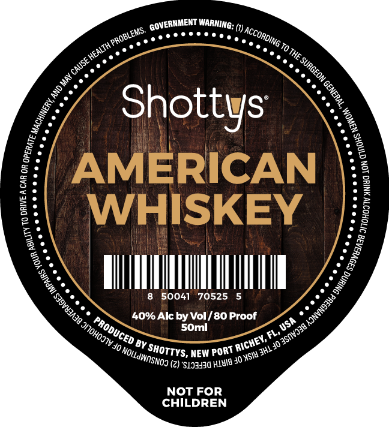

# TTB COLA Label Images - TTBID 26222001000558

**Brand Name:** SHOTTY'S

**Issue Date:** 08/19/2026

**Origin Code:** 16

**Product Class/Type:** 140

**Source:** [TTB Public COLA Registry](https://ttbonline.gov/colasonline/viewColaDetails.do?action=publicFormDisplay&ttbid=26222001000558)

## Label Images

### Front Label

## Extracted Label Text

*Text extracted via OCR - may contain errors*

**Detected Proof:** 80

### Front Label

WARNING: (1) _
'The
Shottys
AMERICAN
2
3
WHISKEY
50041
70525
40% Alc by Vol / 80 Proof
SOml
Jsh
Fl'
'BY
3hlJo
NEW
(2) 'S1JJHJd HlHIG J0
NOT FOR
CHILDREN
GOVERNMENT
LEMS
) ACCORDING >
{ PROBLE
 HEALTH
(CAUSE
 SURGEON C
) May =
0
9
1
1
0
1
1
1
1
3
1
1
PRODUCED
ONOHOJIV =
) 3Snvj38 /
[RICHEY; !
'ShOTTYS,
'PorT
) NOILdWOSNOJ €
) XSIU =
