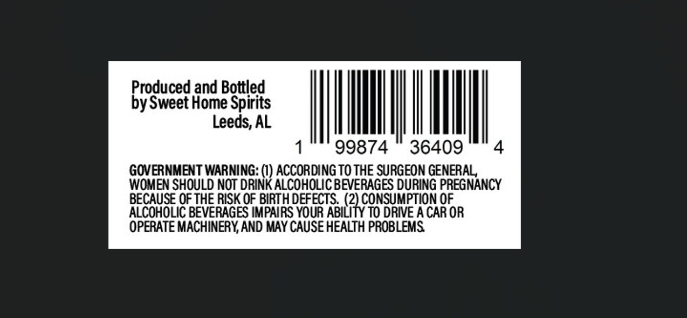
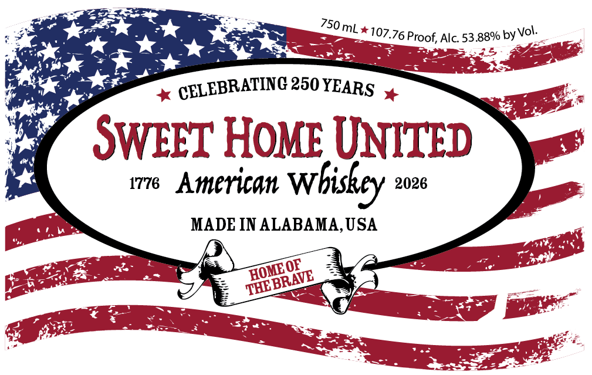

# TTB COLA Label Images - TTBID 26222001000630

**Brand Name:** SWEET HOME UNITED

**Fanciful Name:** AMERICAN WHISKEY

**Issue Date:** 08/31/2026

**Origin Code:** 10

**Product Class/Type:** 140

**Source:** [TTB Public COLA Registry](https://ttbonline.gov/colasonline/viewColaDetails.do?action=publicFormDisplay&ttbid=26222001000630)

## Label Images

### Back Label

### Front Label

## Extracted Label Text

*Text extracted via OCR - may contain errors*

*1 image(s) excluded: text did not meet readability threshold*

### Back Label

Produced and Bottled
by Sweet Home Spirits
Leeds, AL
99874
36409
4
GOVERNMENT WARNING: () ACCORDING TO THE SURGEON GENERAL
WOMEN SHOULD NOT DRINK ALCOHOLIC BEVERAGES DURING PREGNANCY
BECAUSE OF THE RISK OF BIRTH DEFECTS   (2) CONSUMPTION QF
ALCOHOLIC BEVERAGES IMPARS YOUR ABILITY TO DRIVE A CAR OR
OPERATE MACHINERY AND MAY CAUSE HEALTH PROBLEMS
