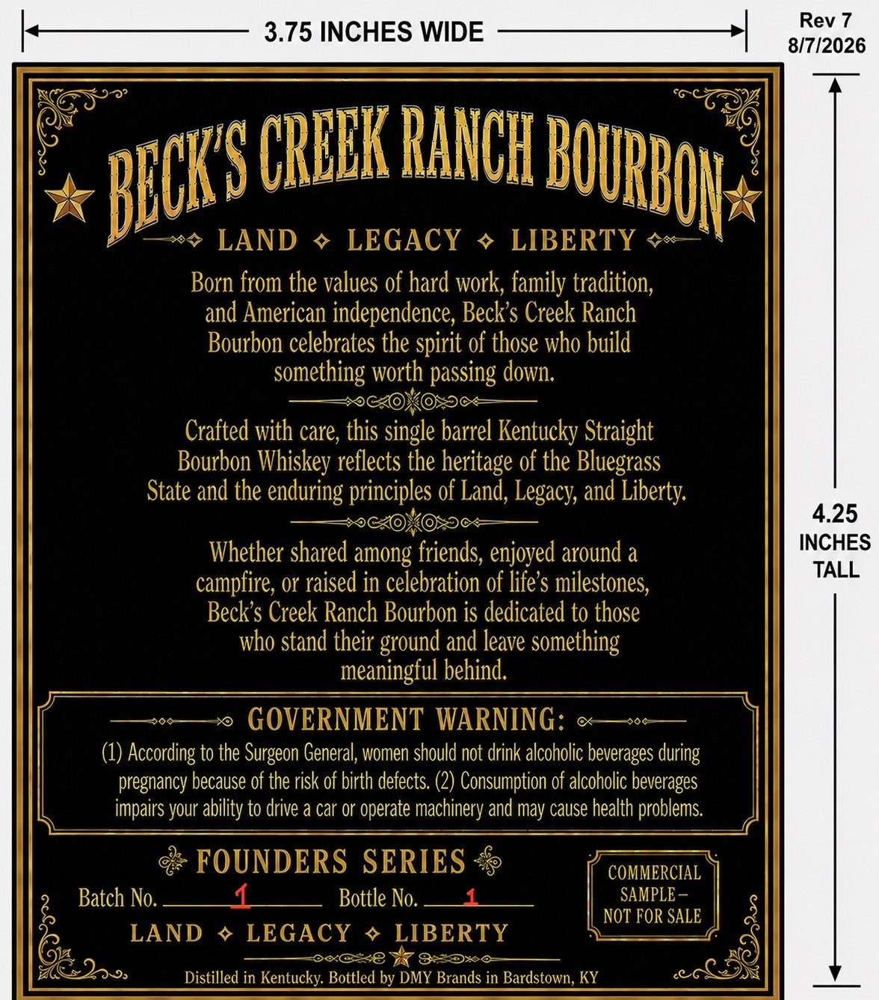
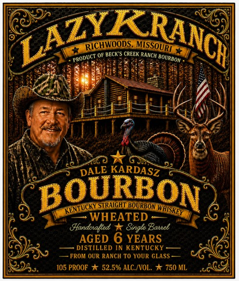

# TTB COLA Label Images - TTBID 26222001000684

**Brand Name:** LAZY K RANCH

**Issue Date:** 08/20/2026

**Origin Code:** 22

**Product Class/Type:** 101

**Source:** [TTB Public COLA Registry](https://ttbonline.gov/colasonline/viewColaDetails.do?action=publicFormDisplay&ttbid=26222001000684)

## Label Images

### Back Label

### Label 1

## Extracted Label Text

*Text extracted via OCR - may contain errors*

**Detected Proof:** 105
**Detected Age:** 6 Years

### Back Label

Rev 7
3.75 INCHES WIDE
8/7/2026
CRUEK RaIcHe
LAND
LEGAcY
LIBERTY
Born from the values of hard work; family tradition;
and American independence, Becks Creek Ranch
Bourbon celebrates the spirit of those who build
something worth passing down;
Crafted with care, this single barrel Kentucky Straight
Bourbon Whiskey reflects the heritage of the Bluegrass
State and the enduring principles of Land, Legacy; and Liberty
4.25
Whether shared among friends, enjoyed around a
INCHES
TALL
campfire, or raised in celebration of life $ milestones;
Beck s Creek Ranch Bourbon is dedicated to those
who stand their ground and leave something
meaningful behind:
GOVERNMENT WARNING:
(1) According to the Surgeon General, women should not drink alcoholic beverages during
pregnancy because of the risk of birth defects. (2) Consumption of alcoholic beverages
impairs your ability to drive & car or operate machinery and may cause health problems
FOUNDERS SERIES
COMMERCIAL
Batch No.
Bottle No.
SAMPLE
NOT FOR SALE
LAND
LEGAcy
LIBERTY
2jss
Distilled in Kentucky: Bottled by DMY Brands in Bardstown, KY
BOURbON
BICKS

### Label 1

LAZYKRAG|
RCHWOODS
OF BECK $ CREEK RaNCH
KARDASZ
BOURBON
BOURBON
WHEATED
Hfandcnafted
Single Banel
AGED 6 YEARS
DISTILLED IN KENTUCKY
FROM OUR RANCH TO YOUR GLASS
105 PROOF * 52.5% ALC /VOL.
'750 ML
MSSOURI
PRODUCT
BOURBON
DALE
KENTUCKYSTRAIGHT
WHSKEY
