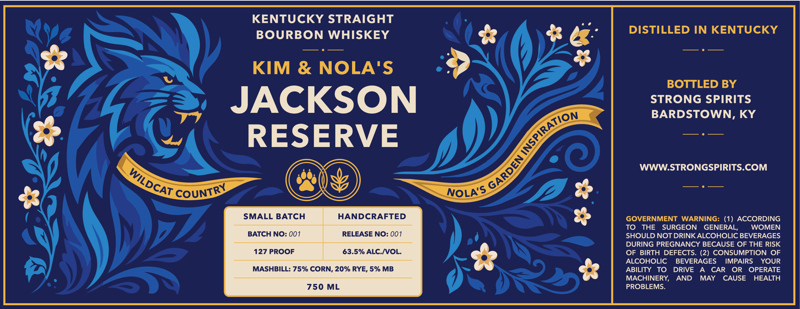
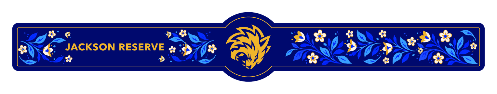

# TTB COLA Label Images - TTBID 26222001000750

**Brand Name:** JACKSON RESERVE

**Issue Date:** 08/20/2026

**Origin Code:** 22

**Product Class/Type:** 101

**Source:** [TTB Public COLA Registry](https://ttbonline.gov/colasonline/viewColaDetails.do?action=publicFormDisplay&ttbid=26222001000750)

## Label Images

### Front Label

### Label 2

## Extracted Label Text

*Text extracted via OCR - may contain errors*

**Detected Proof:** 127

### Front Label

KENTUCKY STRAIGHT
BOURBON WHISKEY
DISTILLED IN KENTUCKY
KIM & NOLA'S
BOTTLED BY
JACKSON
STRONG SPIRITS
BARDSTOWN, KY
RESERVE
WWWSTRONGSPIRITS.COM
NOLA'S
SMALL BATCH
HANDCRAFTED
GOVERNMENT
WARNING: (1) ACCORDING
TO
THE
SURGEON
GENERAL,
WOMEN
BATCH NO: 001
RELEASE NO: 001
SHOULD NOT DRINKALCOHOLIC BEVERAGES
DURING PREGNANCY BECAUSE OF THE RISK
127 PROOF
63.5% ALC NOL.
OF BIRTH DEFECTS. (2) CONSUMPTION OF
ALCOHOLIC
BEVERAGES
IMPAIRS
YOUR
MASHBILL: 75% CORN, 20% RYE, 5% MB
ABILITY
To
DRIVE
CAR
OR
OPERATE
MACHINERY;
AND
MAY
CAUSE
HEALTH
750 ML
PROBLEMS:
INSPIRATION
GARDEN
WILDCAT
CQUNTRY

### Label 2

BYE incxson RESERVE aD

s; Ae a

MG °

ANG

rate

Hy.
