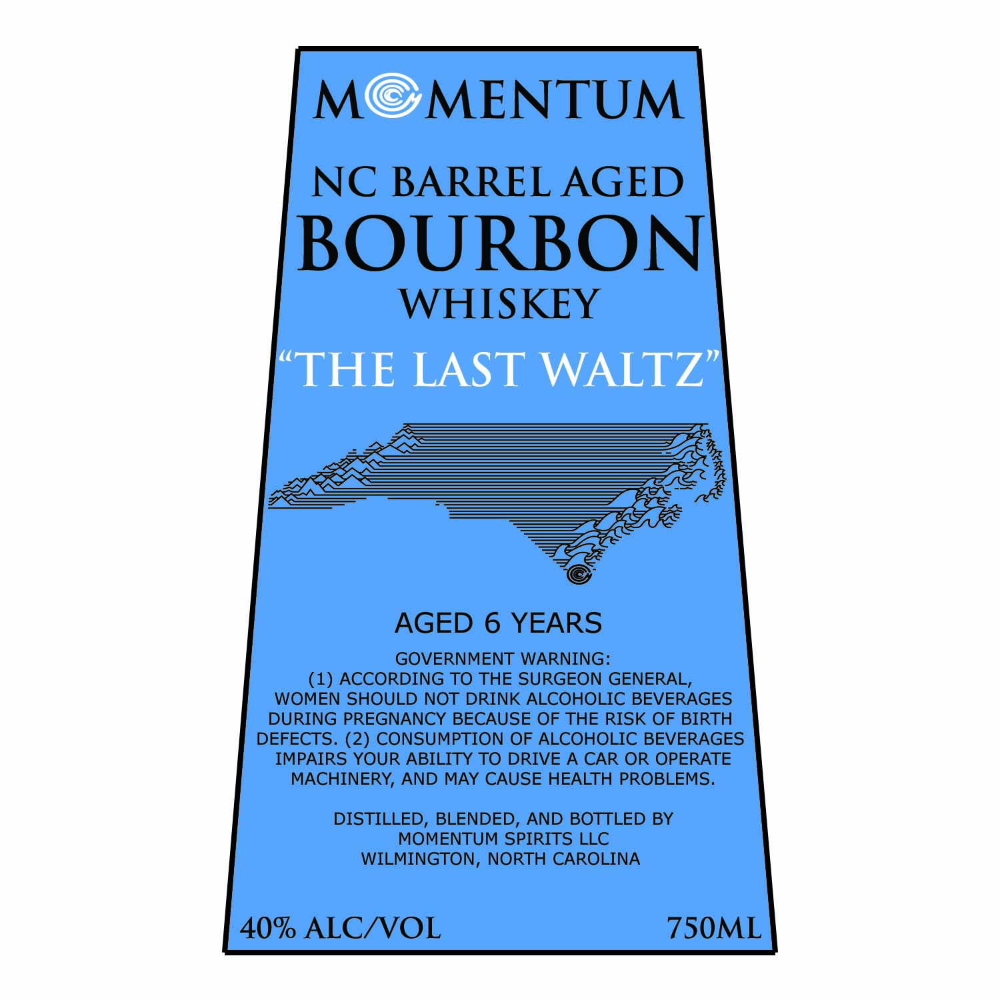

# TTB COLA Label Images - TTBID 26222001000799

**Brand Name:** MOMENTUM NC BARREL AGED

**Issue Date:** 08/21/2026

**Origin Code:** 35

**Product Class/Type:** 141

**Source:** [TTB Public COLA Registry](https://ttbonline.gov/colasonline/viewColaDetails.do?action=publicFormDisplay&ttbid=26222001000799)

## Label Images

### Label 1

## Extracted Label Text

*Text extracted via OCR - may contain errors*

**Detected Proof:** 80
**Detected Age:** 6 Years

### Label 1

MC
MENTUM
NC BARREL AGED
BOURBON
WHISKEY
THE LAST WALTZ |
AGED 6 YEARS
GOVERNMENT WARNING:
(1) ACCORDING TO THE SURGEON GENERAL,
WOMEN SHOULD NOT DRINK ALCOHOLIC BEVERAGES
DURING PREGNANCY BECAUSE OF THE RISK OF BIRTH
DEFECTS. (2) CONSUMPTION OF ALCOHOLIC BEVERAGES
IMPAIRS YOUR ABILITY TO DRIVE A CAR OR OPERATE
MACHINERY, AND MAY CAUSE HEALTH PROBLEMS.
DISTILLED, BLENDED, AND BOTTLED BY
MOMENTUM SPIRITS LLC
WILMINGTON, NORTH CAROLINA
40% ALCNVOL
75OML
