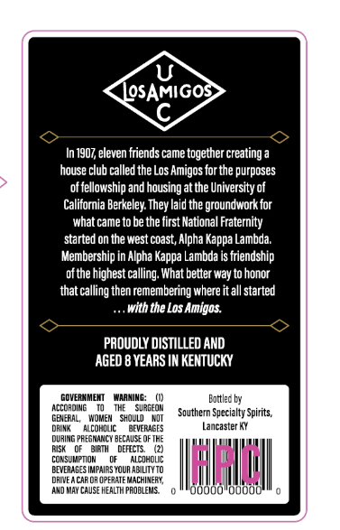
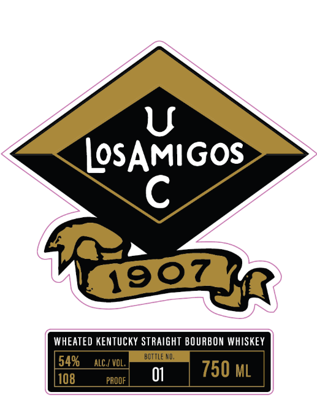

# TTB COLA Label Images - TTBID 26222001000859

**Brand Name:** LOS AMIGOS

**Issue Date:** 08/18/2026

**Origin Code:** 22

**Product Class/Type:** 101

**Source:** [TTB Public COLA Registry](https://ttbonline.gov/colasonline/viewColaDetails.do?action=publicFormDisplay&ttbid=26222001000859)

## Label Images

### Back Label

### Front Label

## Extracted Label Text

*Text extracted via OCR - may contain errors*

**Detected Proof:** 108
**Detected Age:** 8 Years

### Back Label

IOsAMIGOS
In1907,eleven friends came together creating
house club called the Los Amigos for the purposes
of fellowship and housing at the University of
California Berkeley They laid the groundwork for
what came to be the first Mational Fraternity
started on the west coast; Alpha Kappa Lambda:
Membership in Alpha Kappa Lambda is friendship
ofthe highest calling What better way to honor
that calling then remembering where it all started
with the Los Amigos
PROUDLY DISTILLED AND
AGED 8 YEARS IN KENTUCKY
goverxMEMT
WARMING:
Eattlec by
according
sirgeow
Southern Specialty Spirits,
GENERAL,
WOMEM   ShOUld
DRINE
alcohdlic
BEVERAGES
Lancaster KY
DU3InG pF EGMANCy BECAMSE @F THE
RISK
birn
dEFcts
GOVeMaPSOhpaIS Foua AcUhO4g
u
DRIVE /
0?ErATe MacHIMERR,
And May CAUSE HEALTH PROELEMS
dbodolbdodd

### Front Label

U
LOSAMIGOS
C
0"
WHEATED kenTuCkY STRAIGHT BOURBON WHISKEY
54%
ALC / VOL;
Buttle HO;
108
PAOOF
01
750 ML
19
