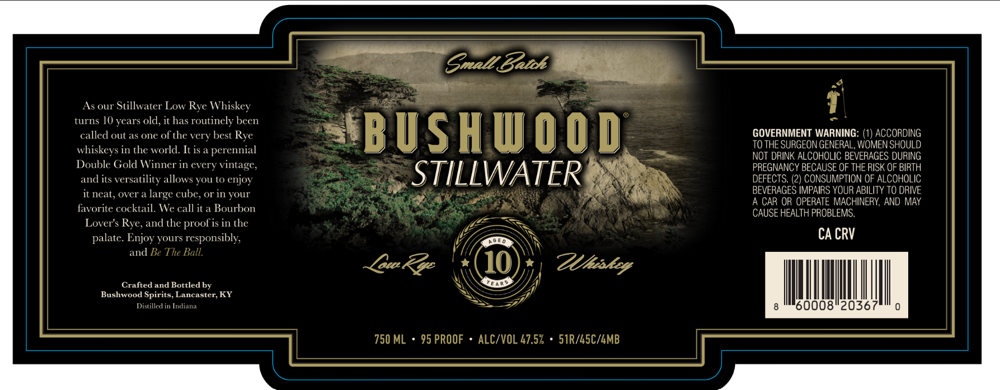

# TTB COLA Label Images - TTBID 26222001000876

**Brand Name:** BUSHWOOD

**Issue Date:** 08/18/2026

**Origin Code:** 22

**Product Class/Type:** 142

**Source:** [TTB Public COLA Registry](https://ttbonline.gov/colasonline/viewColaDetails.do?action=publicFormDisplay&ttbid=26222001000876)

## Label Images

### Label 1

## Extracted Label Text

*Text extracted via OCR - may contain errors*

**Detected Proof:** 95
**Detected Age:** 10 Years

### Label 1

Snall Betk
As our Stillwvater Low Rye Whiskey
turns 10 years old; it has routinely been
called out as one of the very best Rye
BUSAUOOD
GOVERNMENT WARNING: (1) ACCORDING
whiskeys in the world. It is a perennial
TO THE SURGEON GENERAL, WOMEN SHOULD
nOT dRINK ALCOHOLIC BEVERAGES DURING
Double Gold Winner in cvery
vintage,
PREGNANCY BECAUSE OF THE RISK OF BIRTH
and iLs
versatility allows you t0 enjoy
STILLWATER
DEFECTS: (2) CONSUMPTION OF ALCOHOLIC
it neat, over a
large cube, or in your
BEVERAGES IMPAIRS YOUR ABILITY TO DRIVE
A CAR OR OPERATE MACHINERY; AND MAY
favorite cocktail. We call
Bourbon
CAUSE HEALTH PROBLEMS,
Lover's Rye; and the proof is in the
palate: Enjoy yours responsibly;
CA CRV
and Be The Ball.
[Bu&
10
ZUhakey
Crafted and Bottled by
YARS
Bushwood Spirits; Lancaster; KY
Distilled in Indiana
08"2036
750 ML
95 PROOF
ALC/VOL 47.57
51R/LSC/GMB
it a
