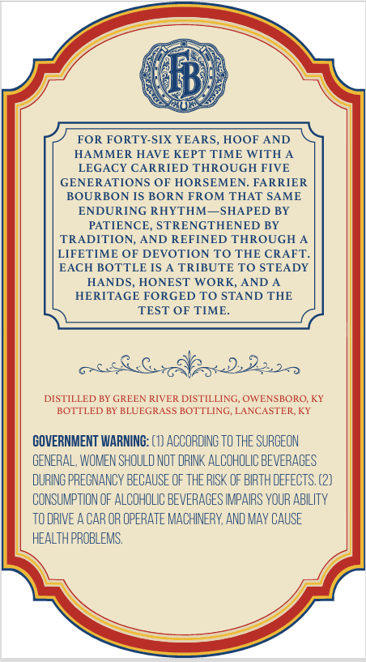
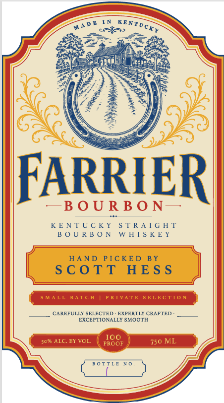

# TTB COLA Label Images - TTBID 26222001000916

**Brand Name:** FARRIER

**Issue Date:** 08/18/2026

**Origin Code:** 22

**Product Class/Type:** 101

**Source:** [TTB Public COLA Registry](https://ttbonline.gov/colasonline/viewColaDetails.do?action=publicFormDisplay&ttbid=26222001000916)

## Label Images

### Back Label

### Front Label

## Extracted Label Text

*Text extracted via OCR - may contain errors*

### Back Label

6jb
FOR FORTY-SIX YEARS
HOOF AND
HAMMER HAVE KEPT TIME WITH A
LEGACY CARRIED THROUGH FIVE
GENERATIONS OF HORSEMEN_
FARRIER
BOURBON IS BORN FROM THAT SAME
ENDURING RHYTHM
SHAPED BY
PATIENCE.
STRENGTHENED BY
TRADITION, AND REFINED THROUGH
LIFETIME OF DEVOTION TO
THE CRAFT
EACH BOTTLE IS A TRIBUTE TO STEADY
HANDS
HONEST WORK, AND
HERITAGE FORGED TO STAND THE
TEST OF TIME.
322p2o
DISTILLED BY GREEN RIVER DISTILLING, OWENSBORO; KY
BOTTLED BY BLUEGRASS BOTTLING LANCASTER KY
GOVERNMENT WARNING: (8) ACCORDING To THE SURGEON
GENERAL, WOMEN SHOULD NOT DRINK ALCOHOLIC BEVERAOES
DURING PREONANCY BECAUSE OF THE RISK OF BIRTH DEFECTS, (2)
CONSUMPTION OF ALCOHOLIC BEVERACES IMPAIRS VOUR ABILITy
TO DRIVE A CAR OR OPERATE MACHINERY AND MAV CAUSE
HEALTH PROBLEMS:

### Front Label

res

DE IN KENTy,

wy

ee

\g

4)

ARRIE

R

—BOURBON

— 5

KENTUCKY STRAIGHT

BOURBON WHISKEY

SCOTT HESS

L BATCH

VAT

CTION

(CAREFULLY SELECTED - EXPERTLY CRAFTED

EXCEPTIONALLY SMOOTH

ema

Cr") Z
