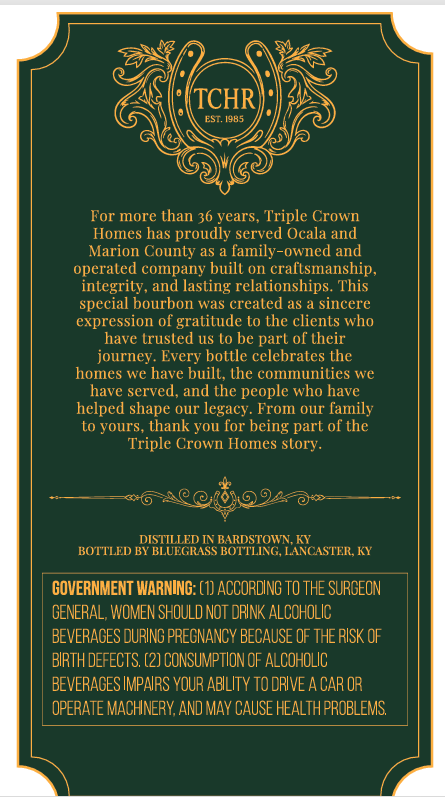
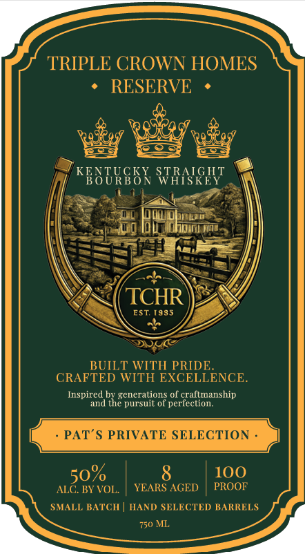

# TTB COLA Label Images - TTBID 26222001000918

**Brand Name:** TRIPLE CROWN HOMES

**Issue Date:** 08/18/2026

**Origin Code:** 22

**Product Class/Type:** 101

**Source:** [TTB Public COLA Registry](https://ttbonline.gov/colasonline/viewColaDetails.do?action=publicFormDisplay&ttbid=26222001000918)

## Label Images

### Back Label

### Front Label

## Extracted Label Text

*Text extracted via OCR - may contain errors*

**Detected Age:** 36 Years

### Back Label

TCHR
EST. 1985
For more than 36 years, Triple Crown
Homes has proudly served Ocala and
Marion County as
family-owned and
operaled company buill on crallsmanship
integrity, and lasting relationships. This
special bOurbon was crealed as
sincere
expression of gratitude to the clients who
have trusled us lo be parl o[ their
journey. Every bottle celebrates the
homes we have buill; lhe communilies we
have served,
the people who have
helped shape our legacy. From our [amily
to yours, thank you for being part of the
Triple Crown Homes slory_
DISTILLED IN BARDSTOWN KV
BOTTLED BY BLUEGRASS BOTTLING, LANCASTERKY
GOVERNMENT WARNING: (8) ACCORDING To THE SURCEON
GENERAL, WOMEN SHOULD NOT dRINK ALCOHOLIC
BEVERAGES DURING PRECNANCY BECAUSE OF THE RISK OF
BIRTH DEfECTS; (2) CONSUMPTION OF ALCohoLIC
BEVERACES IMPARS VOUR AbIlIty tO DRIVE A CAR OR
OPERATE MACHNERY,AND may CAUSE HEALTH PROBLEMS;
and

### Front Label

TRIPLE CROWN HOMES
RESERVE
KESTRSSK SPRASHT
TCHR
EST 1985
BUILT WITH PRIDE
CRAFTED WITH EXCELLENCE
Inspired by generalions O[ crallmanship
and the pursuit of perfection.
PAT $ PRIVATE SELECTION
50
8
100
ALC. BY VOL.
YEARS AGED
PROOF
SMALL BATCH
HAND SELECTED BARRELS
750 ML
