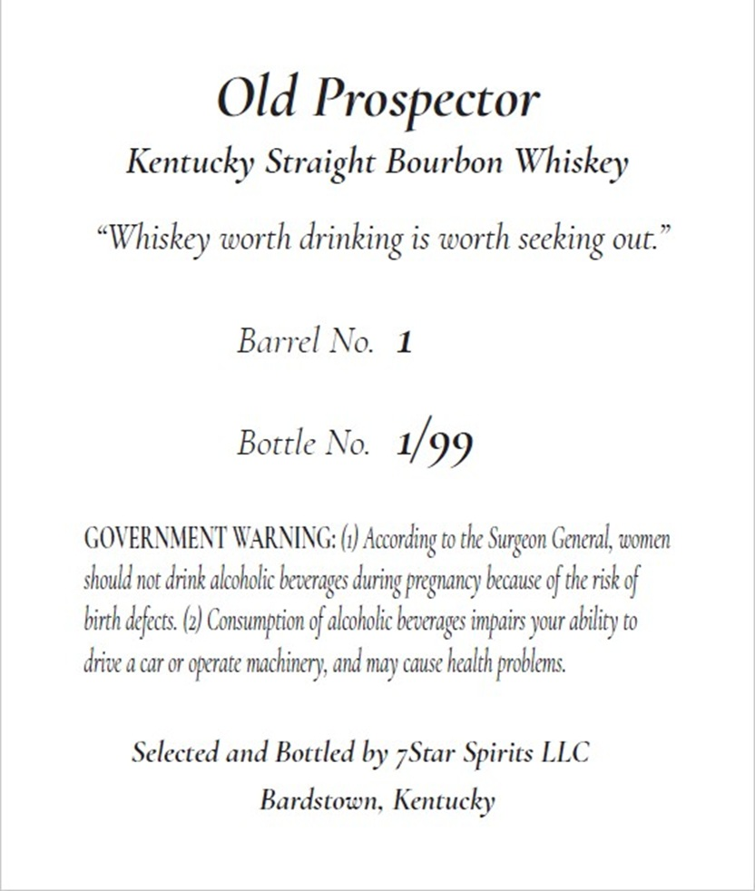
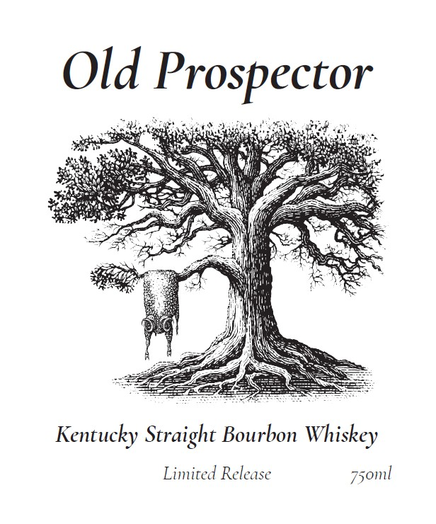
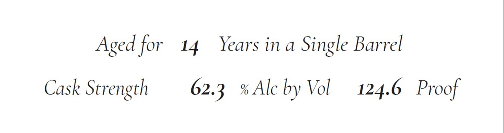

# TTB COLA Label Images - TTBID 26223001000115

**Brand Name:** OLD PROSPECTOR

**Issue Date:** 08/18/2026

**Origin Code:** 22

**Product Class/Type:** 101

**Source:** [TTB Public COLA Registry](https://ttbonline.gov/colasonline/viewColaDetails.do?action=publicFormDisplay&ttbid=26223001000115)

## Label Images

### Back Label

### Label 1

### Label 2

## Extracted Label Text

*Text extracted via OCR - may contain errors*

**Detected Proof:** 124.6
**Detected Age:** 14 Years

### Back Label

Old Prospector

Kentucky Straight Bourbon Whiskey

“Whiskey worth drinking is worth seeking out.”

Barrel No. 1

Bottle No. 1/ 99

GOVERNMENT WARNING: (1) According to the Surgeon General, women

should not drink alcoholic beverages during pregnancy because ofthe risk of

birth defects. (2) Consumption of alcoholic beverages impairs your ability to

drive a car or operate machinery, and may cause health problems.

Selected and Bottled by 7Star Spirits LLC

Bardstown, Kentucky

### Label 1

Old Prospector

Kentucky Straight Bourbon Whiskey

Limited Release 750ml

### Label 2

Aged for 14 Years ina Single Barrel

Cask Strength

62.3 % Alc by Vol

124.6 Proof
