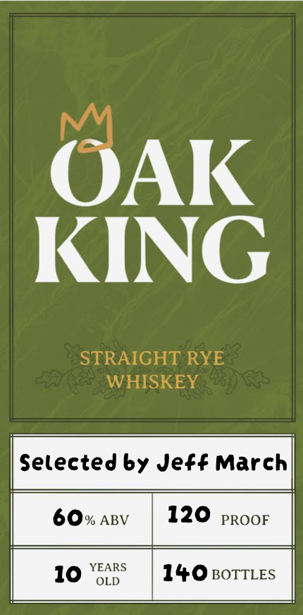
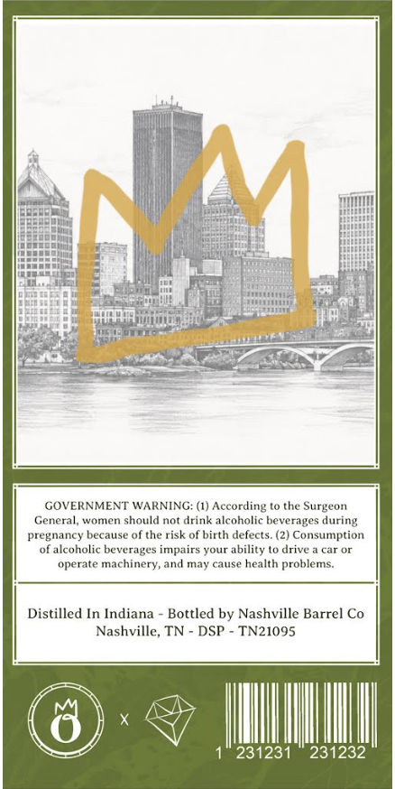

# TTB COLA Label Images - TTBID 26223001000120

**Brand Name:** OAK KING

**Issue Date:** 08/18/2026

**Origin Code:** 43

**Product Class/Type:** 102

**Source:** [TTB Public COLA Registry](https://ttbonline.gov/colasonline/viewColaDetails.do?action=publicFormDisplay&ttbid=26223001000120)

## Label Images

### Label 1

### Label 2

## Extracted Label Text

*Text extracted via OCR - may contain errors*

**Detected Proof:** 120

### Label 1

OAK
KING
STRAIGHT RYE
WHISKEY
Selected by Jeff March
60% ABV
120
PROOF
YEARS
10
OLD
140 BOTTLES

### Label 2

OM cic
es =
Me A 3
i ie
(a A
~s | Hi!) jess |
Euetci | ae it
tite Seat pees
Pact 2 IB toa sons i
febser oust (i a, Hee
Mit A ae Bil is | sf ral
fe sese-nit Nha ca aaa i
Hack RAPP ire a ides:
beater We i wa ner
eae eS ——
fest an A iN
Pa aetna
GOVERNMENT WARNING: (1) According to the Surgeon
General, women should not drink aleoholie beverages during
pregnancy because of the risk of birth defects. (2) Consumption
of alcoholic beverages impairs your ability to drive a car or
operate machinery, and may cause health problems.
Distilled In Indiana - Bottled by Nashville Barrel Co
Nashville, TN - DSP - TN21095
VAG oN =
Ss
(@) J NV
SZ 1° 231231 231232
