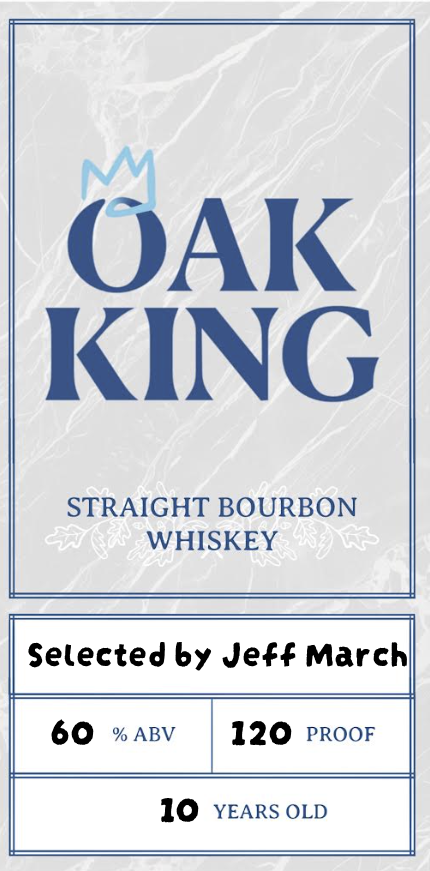
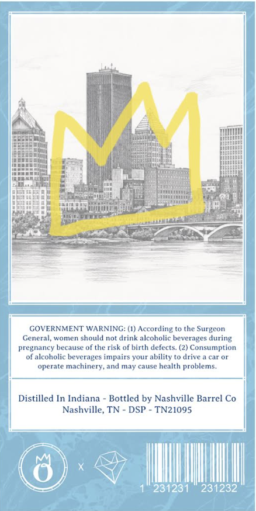

# TTB COLA Label Images - TTBID 26223001000124

**Brand Name:** OAK KING

**Issue Date:** 08/20/2026

**Origin Code:** 43

**Product Class/Type:** 101

**Source:** [TTB Public COLA Registry](https://ttbonline.gov/colasonline/viewColaDetails.do?action=publicFormDisplay&ttbid=26223001000124)

## Label Images

### Label 1

### Label 2

## Extracted Label Text

*Text extracted via OCR - may contain errors*

**Detected Proof:** 120
**Detected Age:** 10 Years

### Label 1

OAK
KING
STRAIGHT BOURBON
WHISKEY
Selected by Jeff Marchl
60
% ABV
120
PROOF
10
YEARS OLD

### Label 2

am)» | - =
a [Sate tat
Isat 4 piece reeset
Ha nw aa nel
Heeaeeied Dog Dulhan Ha
BERGE) é Nail sa eae ina
bs 4 , =. 5 ig Cains fae:
|| eS wees: ee te Ree ee
TET Simin FO Regs aman at
Pee eepeer Pe Pr ct ie
| ieee ae Reese = RC sn ar
‘wala Oars <A Koa %
a
GOVERNMENT WARNING: (1) According to the Surgeon
Genel worms sold pot itt alesbolle bererogen icing
pregnancy because of the risk of birth defects. (2) Consumption
SCGIESUHIC Deve eet pales yore Sly aie cata
opera machinery, sil uaycaues ho preslana
Distilled In Indiana - Bottled by Nashville Barrel Co
Nashville, TN - DSP - TN21095,
y N mT
i im WT A
: |
f ) L I Wii}
DP SESS WA AAA
VU 7 | WL
