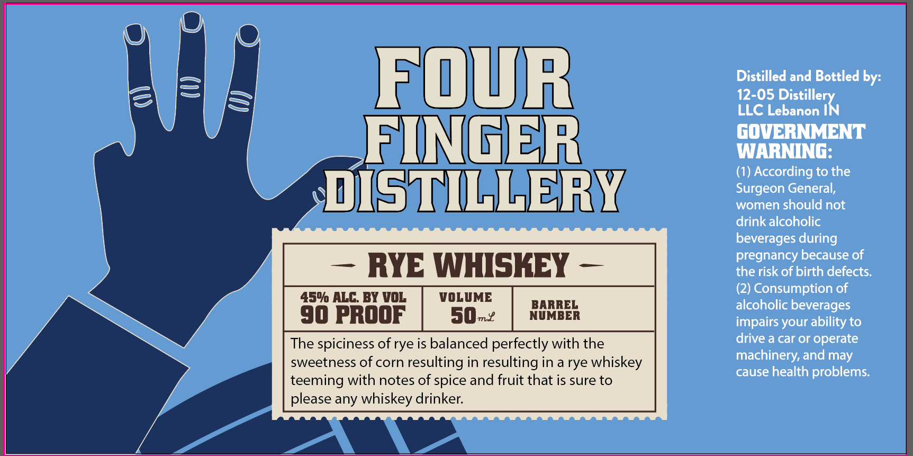

# TTB COLA Label Images - TTBID 26223001000177

**Brand Name:** FOUR FINGER DISTILLERY

**Issue Date:** 08/25/2026

**Origin Code:** 19

**Product Class/Type:** 142

**Source:** [TTB Public COLA Registry](https://ttbonline.gov/colasonline/viewColaDetails.do?action=publicFormDisplay&ttbid=26223001000177)

## Label Images

### Label 1

## Extracted Label Text

*Text extracted via OCR - may contain errors*

**Detected Proof:** 90

### Label 1

FOUR
Distilled and Bottled by:
12-05 Distillery
LLC Lebanon IN
FINGER
GQNERNMENT
(1) According to the
dIsTILLERY
Surgeon General,
women should not
drink alcoholic
beverages during
pregnancy because of
RYE WHISKEY
the risk of birth defects.
(2) Consumption of
450 ALC; BY VOL
VOLUME
BARREL
alcoholic beverages
90 pROOF
s0n2
NUMBER
impairs your ability to
The spiciness of rye is balanced perfectly with the
drive a car or operate
sweetness of corn resulting in resulting in a rye whiskey
machinery, and may
cause health problems:
teeming with notes of spice and fruit that is sure to
please any whiskey drinker:
