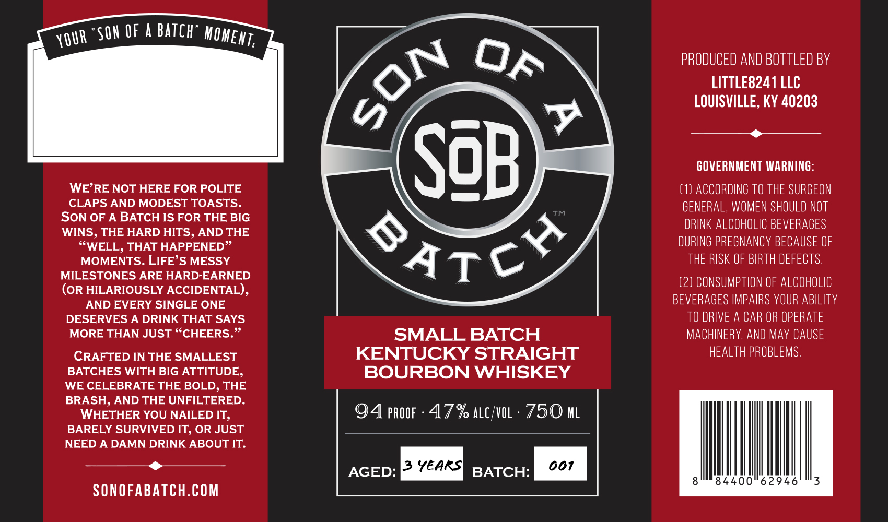

# TTB COLA Label Images - TTBID 26223001000410

**Brand Name:** SON OF A BATCH

**Issue Date:** 08/24/2026

**Origin Code:** 22

**Product Class/Type:** 101

**Source:** [TTB Public COLA Registry](https://ttbonline.gov/colasonline/viewColaDetails.do?action=publicFormDisplay&ttbid=26223001000410)

## Label Images

### Front Label

## Extracted Label Text

*Text extracted via OCR - may contain errors*

**Detected Proof:** 94

### Front Label

Son €F
A
batch
PRODUCED AND BOTTLED BY
LITTLE8241 LLC
LOUISVILLE, KY 40203
7
SzB
COVERNMENT WARNINC:
WE'RE NOT HERE FOR POLITE
(1) ACCORDING TO THE SURGEON
CLAPS AND MODEST TOASTS.
GENERAL, WOMEN SHOULD NOT
SON OF
A BATCH IS FOR THE BIG
DRINK ALCOHOLIC BEVERAGES
WINS, THE HARD HITS, AND THE
SWELL, THAT HAPPENED"
SATLY/
DURING PREGNANCY BECAUSE OF
MOMENTS. LIFE'S MESSY
THE RISK OF BIRTH DEFECTS,
MILESTONES ARE HARD-EARNED
(2) CONSUMPTION OF aLCOhOLIC
(OR HILARIOUSLY ACCIDENTAL) ,
AND EVERY SINGLE ONE
BEVERAGES IMPAIRS VOUR ABILITY
DESERVES A DRINK THAT SAYS
TO DRIVE A CAR OR OPERATE
MORE THAN JUST
CHEERS_
SMALL BATCH
MACHINERY; And May CAUSE
CRAFTED IN THE SMALLEST
KENTUCKY STRAIGHT
hEALTH PROBLEMS.
BATCHES WITH BIG ATTITUDE,
BOURBON WHISKEY
WE CELEBRATE THE BOLD, THE
BRASH, AND THE UNFILTERED.
WHETHER YOU NAILED IT,
4 pROOF
47% ALC/VOL
750 ML
BARELY SURVIVED IT; OR JUST
NEED A DAMN DRINK ABOUT IT.
3 Yeaksi
001
AGED:
BATCH:
84400"62946
3
SONOFABATCH.COM
MOMENT:
YOUR
OF
SON
