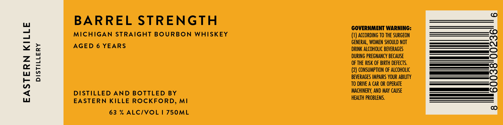

# TTB COLA Label Images - TTBID 26223001000419

**Brand Name:** EASTERN KILLE DISTILLERY

**Issue Date:** 08/20/2026

**Origin Code:** 06

**Product Class/Type:** 101

**Source:** [TTB Public COLA Registry](https://ttbonline.gov/colasonline/viewColaDetails.do?action=publicFormDisplay&ttbid=26223001000419)

## Label Images

### Label 1

## Extracted Label Text

*Text extracted via OCR - may contain errors*

**Detected Proof:** 126
**Detected Age:** 6 Years

### Label 1

BARREL STRENGTH

GOVERNMENT WARNING:

MICHIGAN STRAIGHT BOURBON WHISKEY

(1) ACCORDING TO THE SURGEON

AGED 6 YEARS

GENERAL, WOMEN SHOULD NOT

DRINK ALCOHOLIC BEVERAGES

DURING PREGNANCY BECAUSE

OF THE RISK OF BIRTH DEFECTS.

(2) CONSUMPTION OF ALCOHOLIC

BEVERAGES IMPAIRS YOUR ABILITY

TO DRIVE A CAR OR OPERATE

DISTILLED AND BOTTLED BY

MACHINERY, AND MAY CAUSE

HEALTH PROBLEMS.

EASTERN KILLE ROCKFORD, MI

63 % ALC/VOL | 750ML
