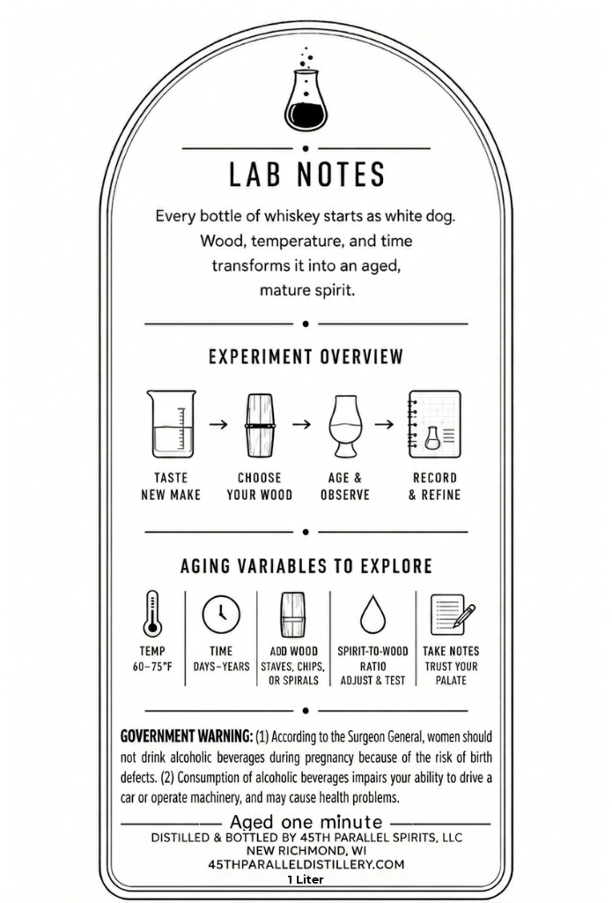
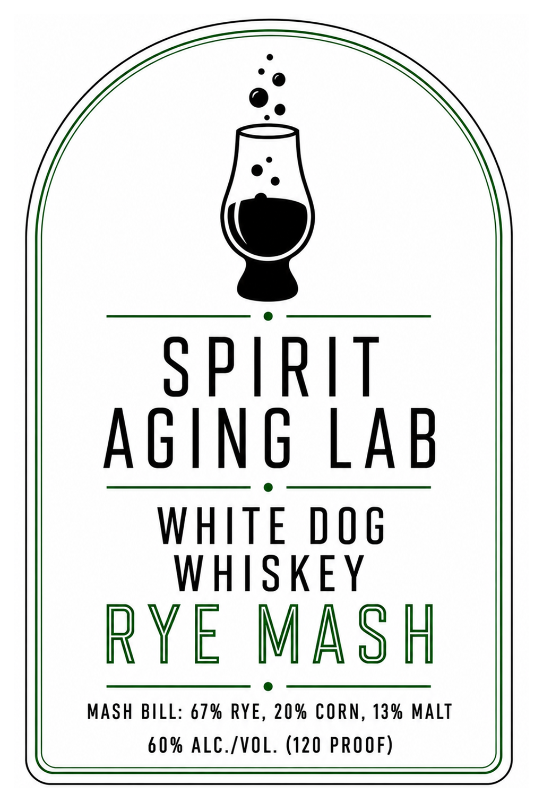

# TTB COLA Label Images - TTBID 26223001000446

**Brand Name:** SPIRIT AGING LAB

**Fanciful Name:** RYE MASH

**Issue Date:** 10/05/2026

**Origin Code:** 48

**Product Class/Type:** 140

**Source:** [TTB Public COLA Registry](https://ttbonline.gov/colasonline/viewColaDetails.do?action=publicFormDisplay&ttbid=26223001000446)

## Label Images

### Back Label

### Label 1

## Extracted Label Text

*Text extracted via OCR - may contain errors*

**Detected Proof:** 120

### Back Label

LAB NOTES
Every bottle of whiskey starts as white
Wood, temperature; and time
transforms it into an aged,
mature spirit:
EXPERIMENT OVERVIEW
TASTE
CHOOSE
AGE &
RECORD
NEW Make
YOUR WOOd
OBSERVE
REFINE
aging VARIABLES TO EXPLORE
TEMP
TIME
Add WOOD
SPIRIT-TO-WoOd
Take MoteS
60-75"F
DAYS - YEARS
STAVES, CHIPS;
RATIO
TRUST YOUR
OR SPIRALS
ADJUST
TEST
PALATE
GOVERNMENT WARNING: (1) According to the Surgeon General, women should
not
drink alcoholic beverages during pregnancy because of the risk of birth
defects: (2) Consumption of alcoholic beverages impairs your ability to drive
car Or
operate machinery; and may cause health problems.
Aged one minute
DISTILLED & BOTTLED BY 4STH PARALLEL SPIRITS, LLC
NEW RICHMOND
45THPARALLELDISTILLERYCOM
Liter
dog:

### Label 1

SPIRIT
AGING LAB
WHITE DOG
WHISKEY
RYE MASH
60% ALC./VOL. (120 PROOF)
