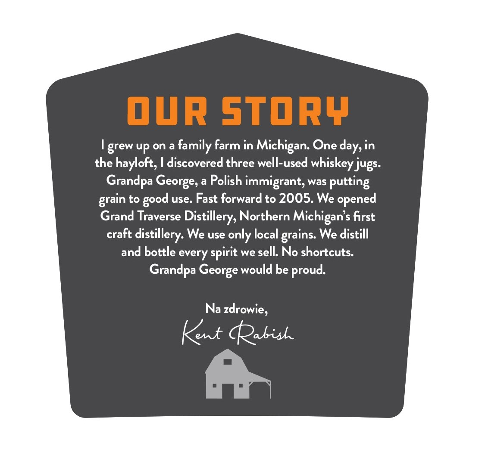
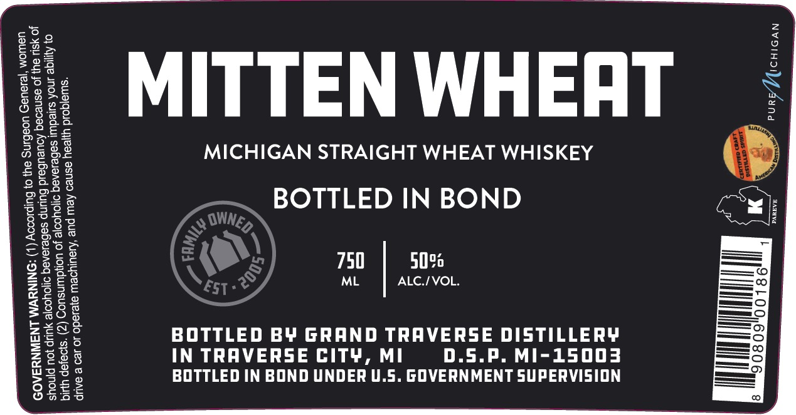

# TTB COLA Label Images - TTBID 26223001000533

**Brand Name:** MITTEN WHEAT

**Fanciful Name:** BOTTLED IN BOND STRAIGHT WHEAT WHISKEY

**Issue Date:** 08/21/2026

**Origin Code:** 06

**Product Class/Type:** 119

**Source:** [TTB Public COLA Registry](https://ttbonline.gov/colasonline/viewColaDetails.do?action=publicFormDisplay&ttbid=26223001000533)

## Label Images

### Back Label

### Label 1

## Extracted Label Text

*Text extracted via OCR - may contain errors*

**Detected Proof:** 100

### Back Label

our story
grew up on a
family farm in
One day, in
the hayloft, I discovered three well-used whiskey jugs.
a
Polish immigrant, was putting
to
use: Fast forward to 2005. We
Grand Traverse Distillery, Northern Michigan s first
craft
We use only local
We distill
and bottle every spirit we sell: No shortcuts:
Grandpa George would be proud
Na zdrowie,
Kent Qabis
Michigan: '
Grandpa
George; '
opened
grain
good
distillery:
grains:

### Label 1

Pas)

Gx2

Fee

2235

Pode

fossa

Osea

£356

ae}

MITTEN WHEAT

ses

of ES

Pons

Sedo

DASoe

2oakeo

cs

MICHIGAN STRAIGHT WHEAT WHISKEY

ESB

aS

eaoK

P2oz

ceELs

ee)

BOTTLED IN BOND

Peee

Sa

ou

Lose

8a2

Skos

CGeG

oSs

750

50%

O25

a6

ML

ALC./VOL.

—— ©

Zeeres

eeoea

Zose

—

=>

2o

8&

——

BOS

— O

Z2eNo

i=

BOTTLED B¥ GRAND TRAVERSE DISTILLERY

eommnend,

heconensid,” 2

SHES

=ts

-——fe)

Zo

ze

£8

IN TRAVERSE CITY, MI

D.S.P. MI-15003

(esomminnsy * f

wosa

>See

BOTTLED IN BOND UNDER U.S. GOVERNMENT SUPERVISION

eet

O8te

O50
