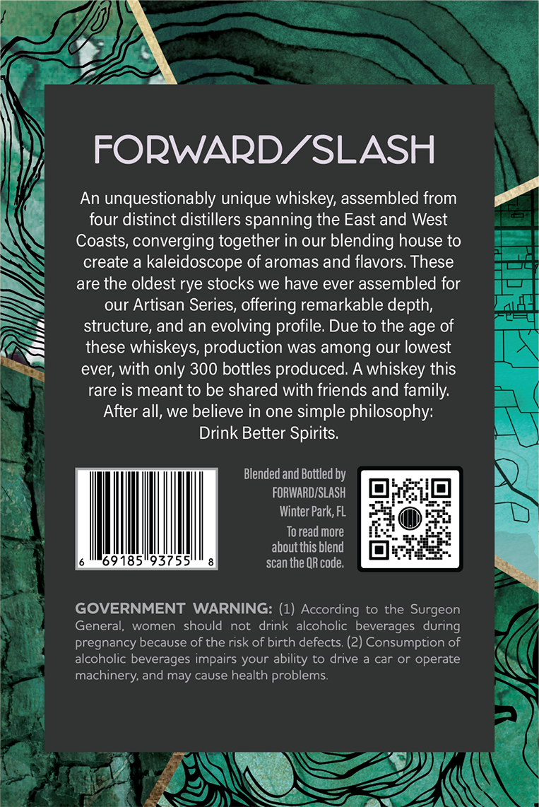
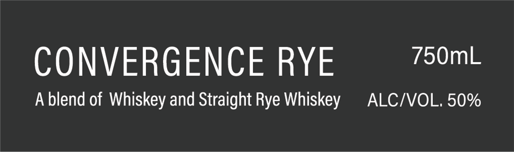
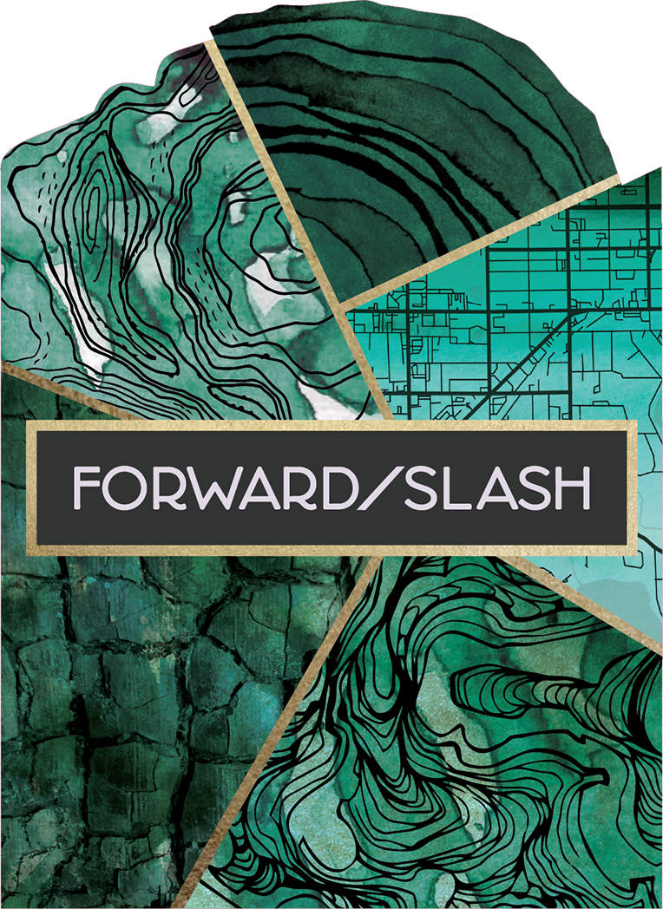

# TTB COLA Label Images - TTBID 26223001000536

**Brand Name:** FORWARD/SLASH

**Fanciful Name:** CONVERGENCE RYE

**Issue Date:** 08/19/2026

**Origin Code:** 16

**Product Class/Type:** 137

**Source:** [TTB Public COLA Registry](https://ttbonline.gov/colasonline/viewColaDetails.do?action=publicFormDisplay&ttbid=26223001000536)

## Label Images

### Back Label

### Label 1

### Label 2

### Label 4

## Extracted Label Text

*Text extracted via OCR - may contain errors*

*1 image(s) excluded: text did not meet readability threshold*

**Detected Proof:** 100

### Back Label

FORWARDZSLASH
An unquestionably unique whiskey, assembled from
four distinct distillers spanning the East and West
Coasts, converging together in our blending house to
create a kaleidoscope of aromas and flavors These
are the oldest rye stocks we have ever assembled for
our Artisan Series; offering remarkable depth,
structure, and an evolving profile Due to the age of
these
whiskeys; production was among our lowest
ever; with only 300 bottles produced: A whiskey this
rare is meant to be shared with friends and family:
After all, we believe in one simple philosophy:
Drink Better Spirits:
Blended and Bottled by
FORWARDISLASH
Winter Park, FL
To read more
about this blend
69185"93755
scan the QR code;
GOVERNMENT WARNING: (1) According to the Surgeon
General;
women   should
not  drink alcoholic beverages  during
pregnancy because of the risk of birth defects (2) Consumption of
alcoholic beverages impairs your ability to drive a car
operate
machinery; and may cause health problems:

### Label 1

CONVERGENCE RYE iSO
A blend of Whiskey and Straight Rye Whiskey ALC/VOL. 50%

### Label 4

SLIMIdS Y4L14¢4 WINING DRINK BETTER SPIRITS
