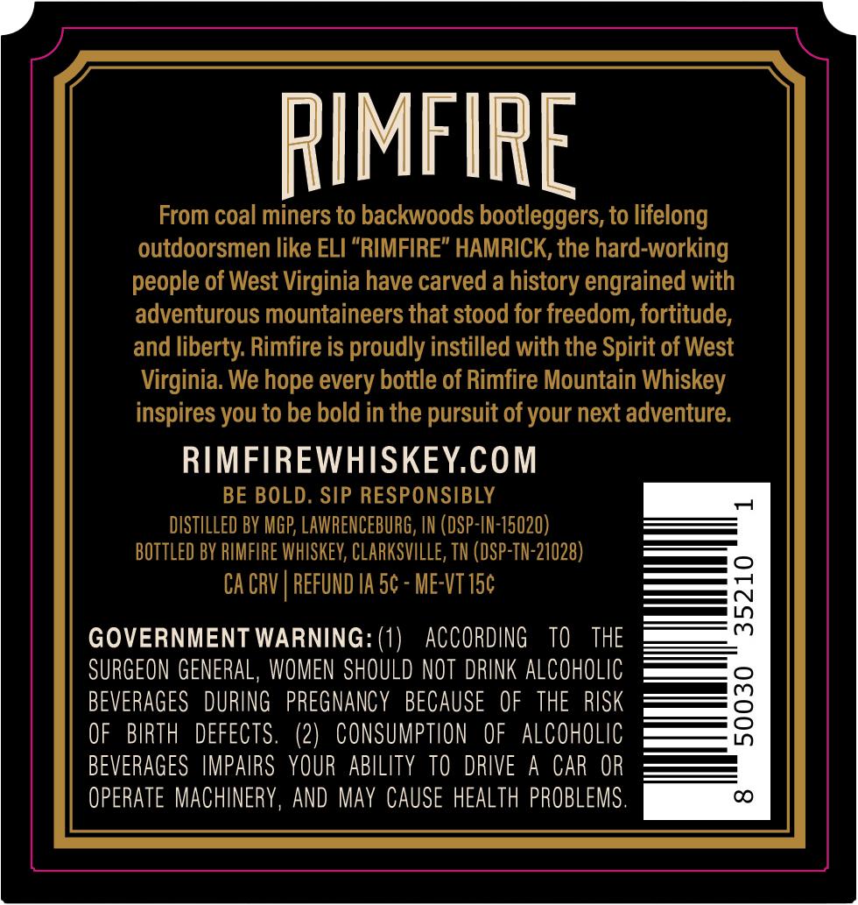
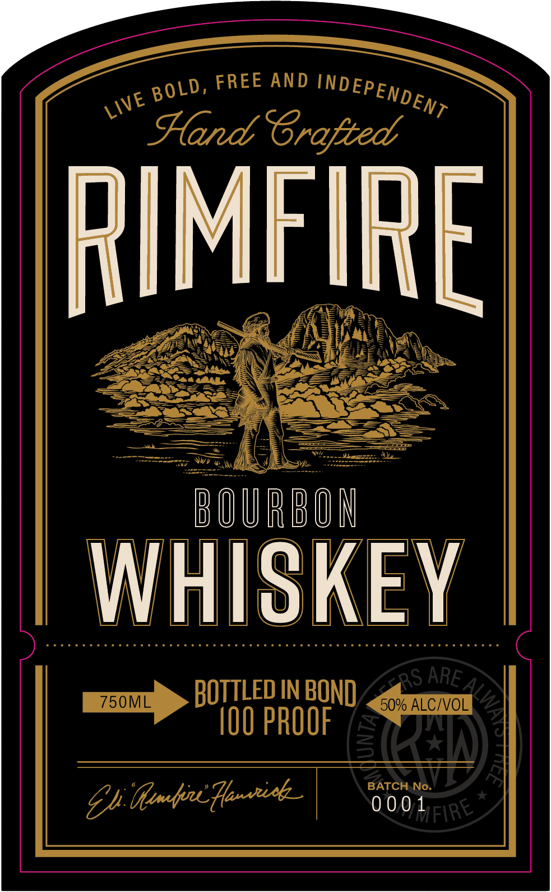

# TTB COLA Label Images - TTBID 26223001000613

**Brand Name:** RIMFIRE

**Issue Date:** 09/28/2026

**Origin Code:** 43

**Product Class/Type:** 141

**Source:** [TTB Public COLA Registry](https://ttbonline.gov/colasonline/viewColaDetails.do?action=publicFormDisplay&ttbid=26223001000613)

## Label Images

### Back Label

### Front Label

## Extracted Label Text

*Text extracted via OCR - may contain errors*

**Detected Proof:** 100

### Back Label

RIMFIPE
From coal miners to backwoods bootleggers, to lifelong
outdoorsmen like ELI "RIMFIRE" HAMRICK, the hard-working
people of West Virginia have carved a history engrained with
adventurous mountaineers that stood for freedom; fortitude;
and liberty: Rimfire is proudly instilled with the Spirit of West
Virginia: We hope every bottle of Rimfire Mountain Whiskey
inspires you to be bold in the pursuit of your next adventure.
RIMFIREWHISKEYCOM
BE BOLD. SIP RESPONSIBLY
DISTILLED BV MGP; LAWRENCEBURG, IN (DSP-IN-15020)
BOTTLED BV RIMFIRE WhISKEV, CLARKSVILLE, TN (DSP-TN-21028)
CA CRV | REFUND IA 5c - Me-VT 15c
1
GOVERNMENT WARNING: (1)
ACCORDING
TO
THE
SURGEON GENERAL, WOMEN SHOULD NOt DRINK AlCohOlic
BEVERAGES   DURING   PREGNANCY   BECAUSE    OF   THE  RISK
8
OF
BIRTH
DEFECTS .
(2)   CONSUMPTION
OF   AlCoholic
BEVERAGES IMPAIRS  YOUR   ABILITY TO   DRIVE
A
CAR OR
OpeRAte MACHINERY, AND May CAUSE HEALTH PROBLEMS .
C

### Front Label

FREE AND
Hand Srafted
RIMFIRE
B OURBOM
WHISKEY
BOTTLed IN BOND
RS
750ML
50% ALCIVOL
IOO PROOF
BATCH No.
Ef Gut_Henorisk_
0001 FIRE
INDEPENDENT
BOLD,
LIVE
ARE_
9
3
