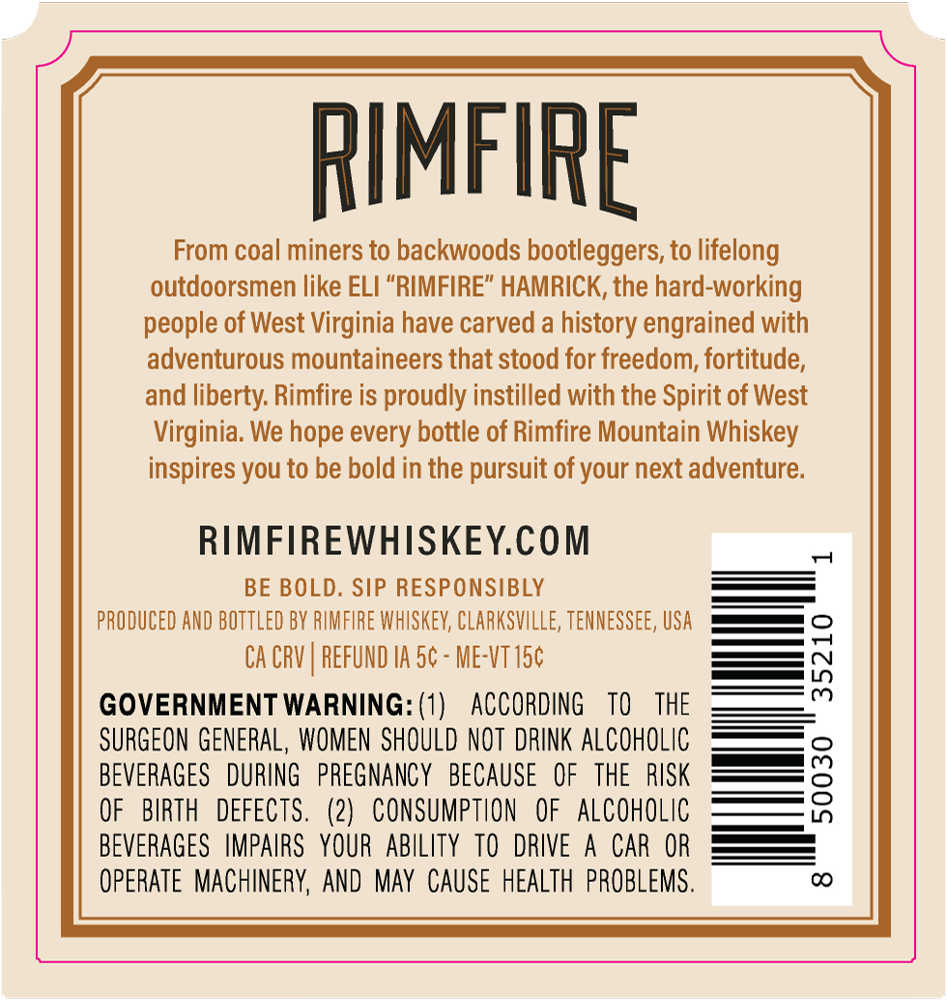
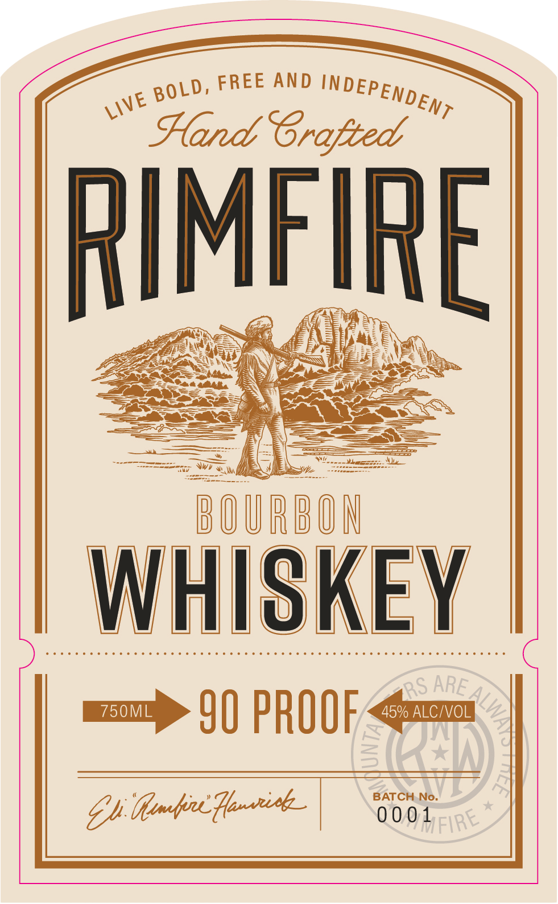

# TTB COLA Label Images - TTBID 26223001000619

**Brand Name:** RIMFIRE

**Issue Date:** 09/14/2026

**Origin Code:** 43

**Product Class/Type:** 141

**Source:** [TTB Public COLA Registry](https://ttbonline.gov/colasonline/viewColaDetails.do?action=publicFormDisplay&ttbid=26223001000619)

## Label Images

### Back Label

### Front Label

## Extracted Label Text

*Text extracted via OCR - may contain errors*

### Back Label

RIMFIRE
From coal miners to backwoods bootleggers, to lifelong
outdoorsmen like ELI "RIMFIRE" HAMRICK, the hard-working
people of West Virginia have carved a history engrained with
adventurous mountaineers that stood for freedom; fortitude,
and liberty Rimfire is proudly instilled with the Spirit of West
Virginia: We hope every bottle of Rimfire Mountain Whiskey
inspires you to be bold in the pursuit of your next adventure:
RIMFIREWHISKEYCOM
BE BOLD. SIP RESPONSIBLY
PRODUCED AND BOTtLed BY RMFIRE WhSkeV; CLARKSVILLE; TENNESSEE, USA
CA CRV
REFUND IA 5c - ME-Vt15c
3
GOVERNMENT WARNING: (1)
ACCORDING
TO
THE
SURGEON GENERAL, WOMEN  SHOULD NOT  DRINK ALCOHOLic
BEVERAGES
DURING   PREGNANCY
BECAUSE
OF
THE
RISK
8
OF
BIRTH   DEFECTS .
(2)   CONSUMPTION
OF
AlcohOlic
BEVERAGES   IMPAIRS   YOUR   ABILITY  TO   DRIVE
A
CAR OR
OpeRATE   MachineRY; AND May  CAuSe heAlTh  PROBLeMS .
CO

### Front Label

Fro

wt

8

oLd FREE AND NPEPEND Ey.

Hand Crofted °

RIMFIRE

ENS

eS

as

— 7 Wa

oe

a

i>

Te saben: 7

pOURBON

WHISKEY

ODN DO DA DD DD OO OC OUND OAD DD OD ODD DD DD OO oOo DDD ND OD ODC0DCD DO SOOUDNDS

mo 9) PROOF <u

0001

Gh tembirc fia.
