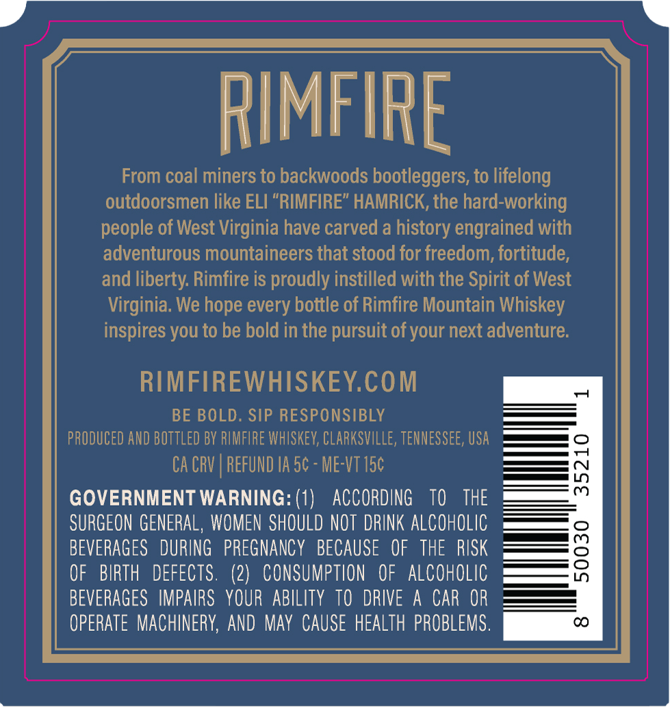
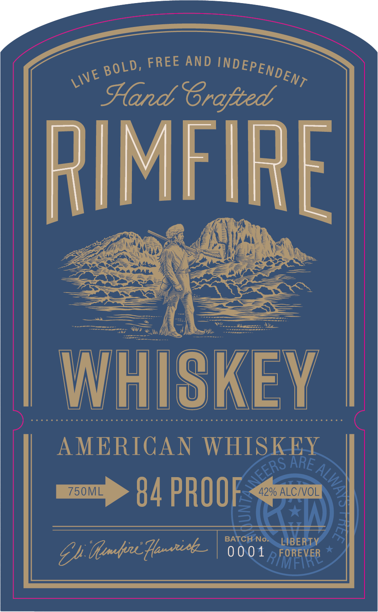

# TTB COLA Label Images - TTBID 26223001000625

**Brand Name:** RIMFIRE

**Issue Date:** 09/14/2026

**Origin Code:** 43

**Product Class/Type:** 140

**Source:** [TTB Public COLA Registry](https://ttbonline.gov/colasonline/viewColaDetails.do?action=publicFormDisplay&ttbid=26223001000625)

## Label Images

### Back Label

### Front Label

## Extracted Label Text

*Text extracted via OCR - may contain errors*

**Detected Proof:** 84

### Back Label

RIMFIRE

From coal miners to backwoods bootleggers, to lifelong

outdoorsmen like ELI “RIMFIRE” HAMRICK, the hard-working

people of West Virginia have carved a history engrained with

adventurous mountaineers that stood for freedom, fortitude,

and liberty. Rimfire is proudly instilled with the Spirit of West

Virginia. We hope every bottle of Rimfire Mountain Whiskey

inspires you to be bold in the pursuit of your next adventure.

RIMFIREWHISKEY.COM

BE BOLD. SIP RESPONSIBLY

PRODUCED AND BOTTLED BY RIMFIRE WHISKEY, CLARKSVILLE, TENNESSEE, USA

CA CRV | REFUND IA 5¢ - ME-VT 15¢

GOVERNMENT WARNING: (1) ACCORDING TO THE

SURGEON GENERAL, WOMEN SHOULD NOT DRINK ALCOHOLIC

BEVERAGES DURING PREGNANCY BECAUSE OF THE RISK

OF BIRTH DEFECTS. (2) CONSUMPTION OF ALCOHOLIC

BEVERAGES IMPAIRS YOUR ABILITY TO DRIVE A CAR OR

OPERATE MACHINERY, AND MAY CAUSE HEALTH PROBLEMS

### Front Label

FREE AND
Hand SGrafted
RIMFIRE
WHISKEY
AMERICAN WHISKEY
750ML
84 PROOF
42% ALCIVOL
BATCH No_
LIBERTY
By duntncHoninh _
0 0 0 1
FOREVER
MFI
INDI
EPENDENT
BOLD,
LIVE
ARE
EERS ,
2
