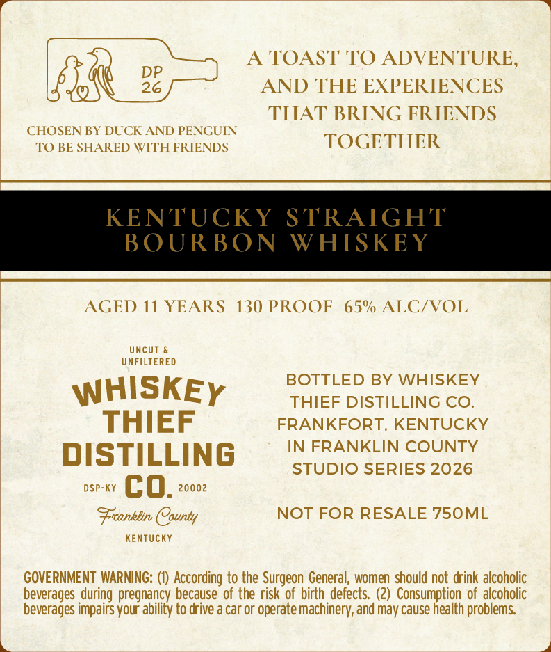
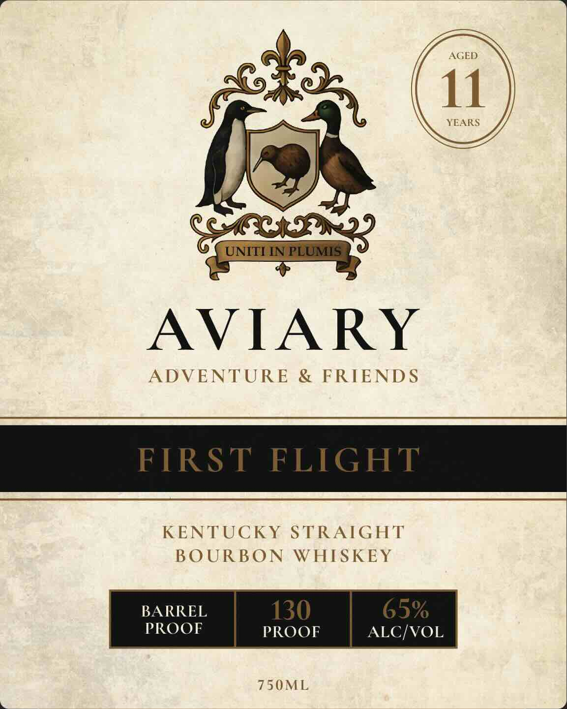

# TTB COLA Label Images - TTBID 26224001000069

**Brand Name:** WHISKEY THIEF DISTILLING CO.

**Fanciful Name:** AVIARY

**Issue Date:** 08/20/2026

**Origin Code:** 22

**Product Class/Type:** 101

**Source:** [TTB Public COLA Registry](https://ttbonline.gov/colasonline/viewColaDetails.do?action=publicFormDisplay&ttbid=26224001000069)

## Label Images

### Back Label

### Front Label

## Extracted Label Text

*Text extracted via OCR - may contain errors*

**Detected Proof:** 130
**Detected Age:** 11 Years

### Back Label

TOAST TO ADVENTURE,
DP
26
AND THE EXPERIENCES
THAT BRING FRIENDS
CHOSEN BY DUCK AND PENGUIN
TO BE SHARED WITH FRIENDS
TOGETHER
KENTUCKY STRAIGHT
BOURBON
WHISKEY
AGED 11 YEARS
130 PROOF
65% ALC/VOL
uncut &
UNFILTERED
BOTTLED BY WHISKEY
WHISKEY
THIEF DISTILLING CO_
THIEF
FRANKFORT, KENTUCKY
dISTILLING
IN FRANKLIN COUNTY
STUDIO SERIES 2026
DSP-KY
co.
20002
Franklin County
NOT FOR RESALE 750ML
KenTUcKY
GOVERNMENT WARNING:
According to the Surgeon General, women should not drink alcoholic
beverages during pregnancy because of the risk of birth defects   (2)   Consumption of alcoholic
beverages impairs your ability to drive a car or operate machinery; and may cause health problems

### Front Label

AGED
11
YEARS
UNITI NIPLUMIS
AVIARY
ADVENTURE
& FRIENDS
FIRST
FLIGHT
KENTUCKY STRAIGHT
BOURBON
WHISKEY
BARREL
130
65%
PROOF
PROOF
ALC/VOL
750ML
