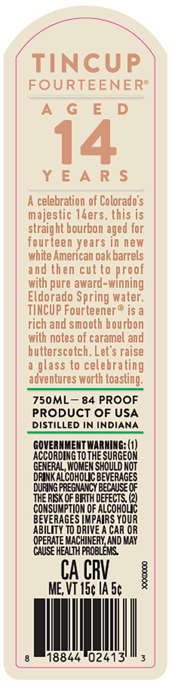
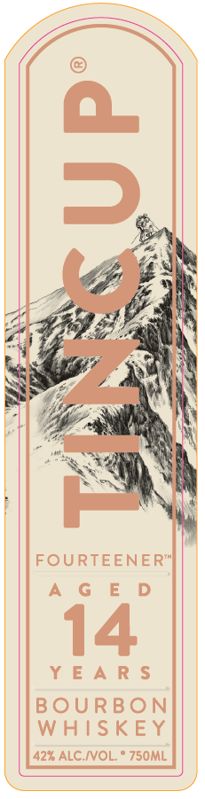
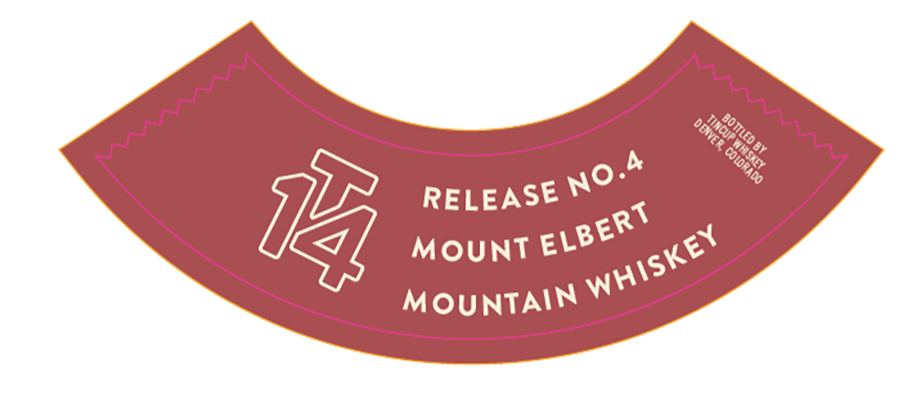

# TTB COLA Label Images - TTBID 26224001000131

**Brand Name:** TINCUP

**Fanciful Name:** 14 YEARS

**Issue Date:** 08/20/2026

**Origin Code:** 13

**Product Class/Type:** 101

**Source:** [TTB Public COLA Registry](https://ttbonline.gov/colasonline/viewColaDetails.do?action=publicFormDisplay&ttbid=26224001000131)

## Label Images

### Back Label

### Front Label

### Label 3

## Extracted Label Text

*Text extracted via OCR - may contain errors*

*1 image(s) excluded: text did not meet readability threshold*

**Detected Proof:** 84
**Detected Age:** 14 Years

### Back Label

FOURTEENER®
AGED

14

YEARS

A celebration of Colorado's
majestic 14ers, this is
straight bourbon aged for
fourteen years in new
white American oak barrels
and then cut to proof
with pure award-winning
Eldorado Spring water.
TINCUP Fourteener® is a
rich and smooth bourbon
with notes of caramel and
butterscotch. Let's raise
a glass to celebrating
adventures worth toasting.

750ML— 84 PROOF

PRODUCT OF USA
DISTILLED IN INDIANA

GOVERNMENT WARNING: (1)
ACCORDING TO THE SURGEON
GENERAL, WOMEN SHOULD NOT
DRINK ALCOHOLIC BEVERAGES
DURING PREGNANCY BECAUSE OF
THE RSX OF BE ORCS
CONSUMPTION OF ALCOHOLIC
BEVERAGES MPa YouR
ABILITY TO DRIVE A CAR OR
OPERATE MACHIVERY

ce

‘ol,

02413

### Label 3

4
RELEASE
14
MOUNT
MOUNTAIN
DOTTLED
Tincup
1
@ouor360
No_
ELBERT
WHISKEY
