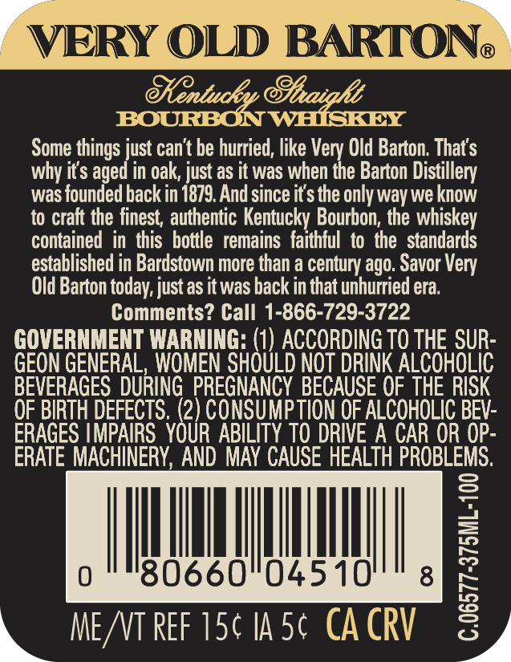
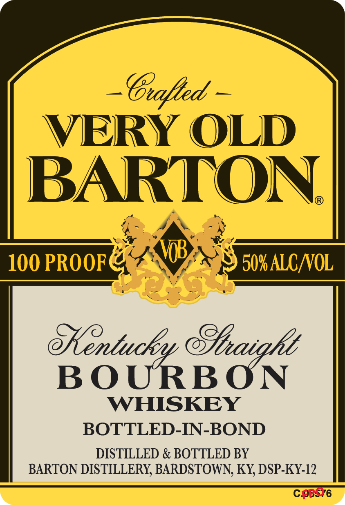

# TTB COLA Label Images - TTBID 26224001000242

**Brand Name:** VERY OLD BARTON

**Issue Date:** 08/20/2026

**Origin Code:** 22

**Product Class/Type:** 111

**Source:** [TTB Public COLA Registry](https://ttbonline.gov/colasonline/viewColaDetails.do?action=publicFormDisplay&ttbid=26224001000242)

## Label Images

### Back Label

### Front Label

## Extracted Label Text

*Text extracted via OCR - may contain errors*

**Detected Proof:** 100

### Back Label

VERY OLD BARTON
@Gntuckp @aiqke
BOURBONWHISKEY
Some
just can't be hurried; like Very Old Barton: Thats
why its aged in oak, just as it was when the Barton Distillery
was founded back in 1879.And since its the only way we know
to cralt the finest, authentic Kentucky Bourbon; the whiskey
contained   in  this   bottle   remains   faithful  to the   standards
established in Bardstown more than a century ago. Savor
Old Barton today, just as it was back in that unhurried era
Comments? Call 1-866-729-3722
GOVERNMENT WARNING: (1) ACCORDING TO THE SUR-
GEON GENERAL, WOMEN SHOULD NOT DRINK ALCOHOLIC
BEVERAGES  DURING  PREGNANCY BECAUSE OF THE RISK
OF BIRTH DEFECTS . (2) CONSUMPTION OF ALCOHOLIC BEV-
ERAGES IMPAIRS   YOUR ABILITY TO DRIVE A CAR OR OP-
ERATE MACHINERY,AND MAY CAUSE HEALTH PROBLEMS.
8
0
80660"04510
8
8
ME NT ReF 15c IA 5c CA CRV
things `
Very

### Front Label

G.fted
VERY OLD
BARTON
100 PROOF
509 ALCAOL
eentuckny eluaigkt
BOURBON
WHISKEY
BOTTLED-IN-BOND
DISTILLED & BOTTLED BY
BARTON DISTILLERY BARDSTOWN; KY DSP-KY-12
Cb876
