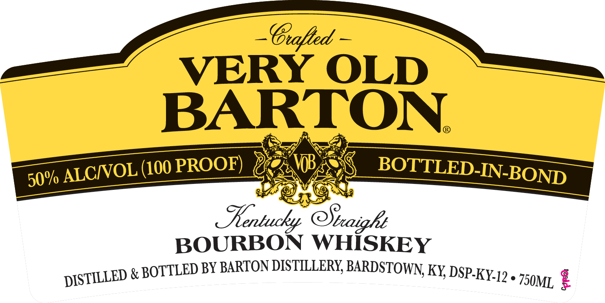
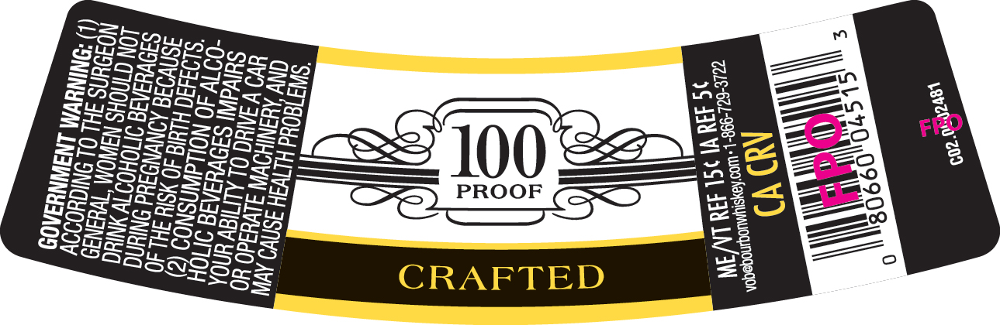

# TTB COLA Label Images - TTBID 26224001000244

**Brand Name:** VERY OLD BARTON

**Issue Date:** 08/20/2026

**Origin Code:** 22

**Product Class/Type:** 111

**Source:** [TTB Public COLA Registry](https://ttbonline.gov/colasonline/viewColaDetails.do?action=publicFormDisplay&ttbid=26224001000244)

## Label Images

### Front Label

### Label 2

## Extracted Label Text

*Text extracted via OCR - may contain errors*

**Detected Proof:** 100

### Front Label

G1afed
VERY OLD
BARTON
ALCIOL (100 PROOF)
BOTTLED-IN-BOND
entucky
BOURBON WHiSKEY
&
BOTTLED BY BARTON DISTLLLERY, BARDSTOWN KY, DSP-KY-I? _
2
50%
@Sbaigkt
DISTILLED
750ML

### Label 2

[S50
PLOW
SSoesoSer
ScSeanoSsse ;
sascanzecee s Bs
Enseeereons a —
S25e> 295483, —JY ue ex 3
PS SS >) ioe z._ eee ;
SSS SS OSS SET ASS: ;
Bosssceecc= es SEB LASS Fi?
Bossece sess <M = 2 ESS <i
pea Aa = ee
SS ee OOae >) PROOF (cS< “3 ::
SeGs lus 2Bss a : =
Sescae PE bare c) net
soezeescess we = on
SasaSecy Ee XA
aeess Rs =e ——=
= RAFTED 25 2
