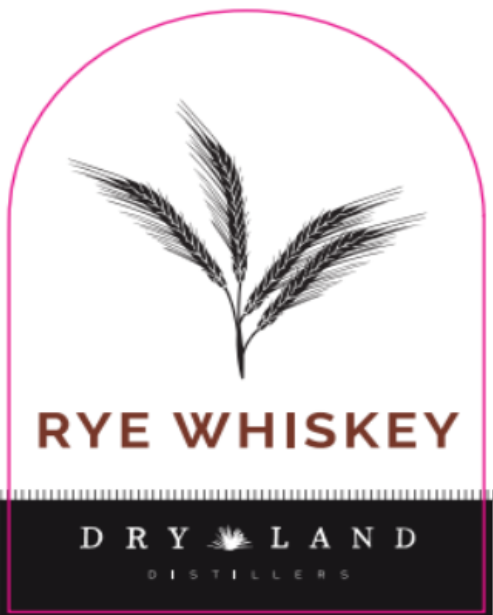
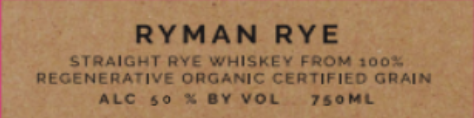

# TTB COLA Label Images - TTBID 26224001000529

**Brand Name:** DRY LAND DISTILLERS

**Issue Date:** 08/21/2026

**Origin Code:** 13

**Product Class/Type:** 102

**Source:** [TTB Public COLA Registry](https://ttbonline.gov/colasonline/viewColaDetails.do?action=publicFormDisplay&ttbid=26224001000529)

## Label Images

### Front Label

### Label 3

## Extracted Label Text

*Text extracted via OCR - may contain errors*

### Front Label

RYE WHISKEY

DRY vlad dit

### Label 3

RYMAN RYE

STRAIGHT RYE WHISKEY FROM 200%

REGENERATIVE ORGANIC CERTIFIED GRAIN

ALC 50 % BY VOL

750ML
