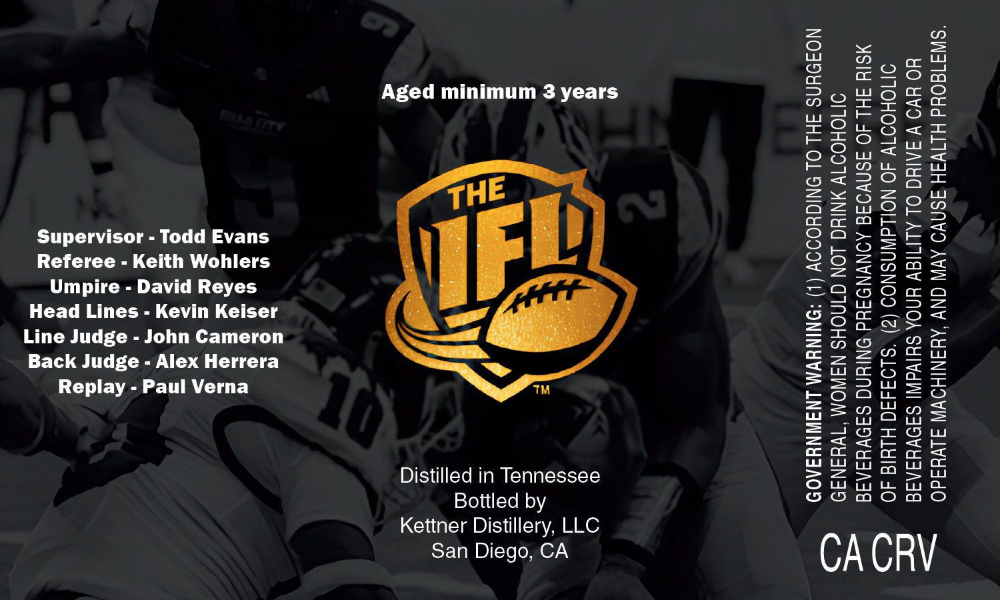

# TTB COLA Label Images - TTBID 26224001000536

**Brand Name:** THE IFL

**Issue Date:** 08/20/2026

**Origin Code:** 01

**Product Class/Type:** 141

**Source:** [TTB Public COLA Registry](https://ttbonline.gov/colasonline/viewColaDetails.do?action=publicFormDisplay&ttbid=26224001000536)

## Label Images

### Front Label

## Extracted Label Text

*Text extracted via OCR - may contain errors*

**Detected Age:** 3 Years

### Front Label

Aged minimum 3 years

Supervisor - Todd Evans

Referee - Keith Wohlers

Umpire - David Reyes

Head Lines - Kevin Keiser

Line Judge - John Cameron

Back Judge - Alex Herrera

Replay - Paul Verna

™

Distilled in Tennessee

Bottled by

Kettner Distillery, LLC

San Diego, CA

CACRV
