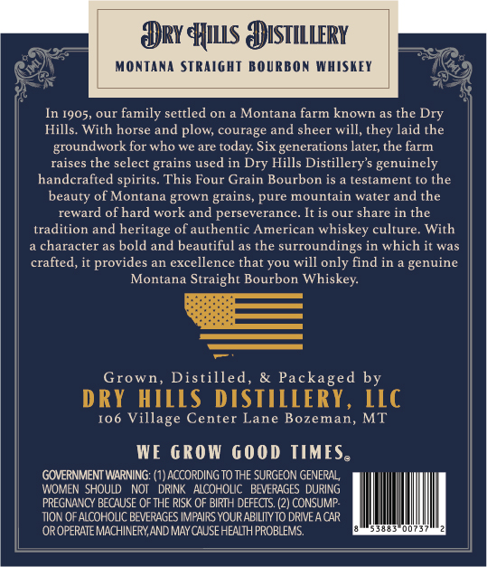
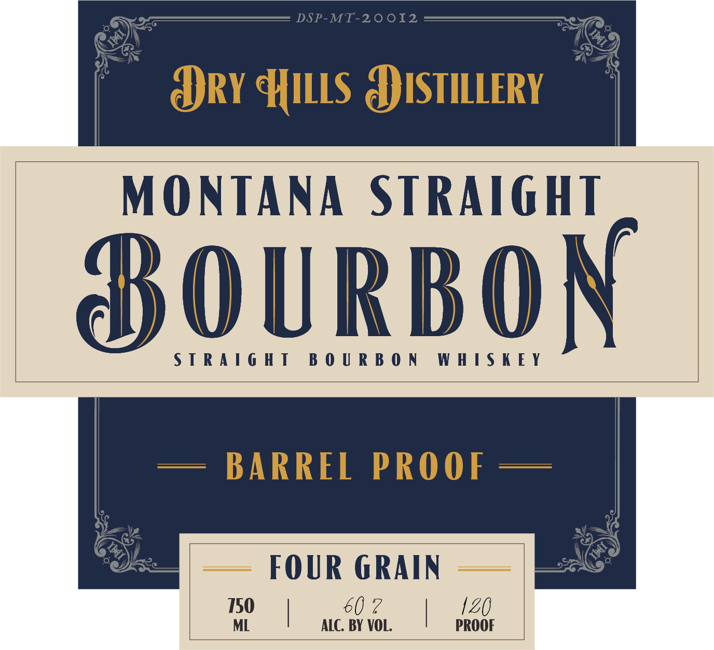
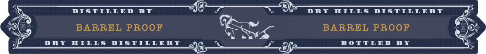

# TTB COLA Label Images - TTBID 26224001000583

**Brand Name:** BARREL PROOF

**Issue Date:** 08/27/2026

**Origin Code:** 30

**Product Class/Type:** 101

**Source:** [TTB Public COLA Registry](https://ttbonline.gov/colasonline/viewColaDetails.do?action=publicFormDisplay&ttbid=26224001000583)

## Label Images

### Back Label

### Front Label

### Label 3

## Extracted Label Text

*Text extracted via OCR - may contain errors*

### Back Label

Dry HuLs DISTILLERY
MonTaNA STRAIGHT BOURBON WHISKEY
In 1905, our family settled on
Montana farm known as the Dry
Hills
With horse and plow, courage and sheer will,
laid the
groundwork for who we are today Six generations later; the farm
raises the select grains used in
Hills Distillery'$ genuinely
handcrafted spirits
This Four Grain Bourbon is
testament t0 the
beauty of Montana grown grains, pure mountain water and the
reward of hard work and perseverance_
It is our share in the
tradition and heritage of authentic American whiskey culture
With
character as bold and beautiful as the surroundings in which it was
crafted, it provides an excellence that you
only find in
genuine
Montana Straight Bourbon Whiskey:
Grown, Distilled
& Packaged by
DRY HILLS DISTILLERY ,
LLC
I0g
Village Center Lane Bozeman, MT
WE GROW 600d TIMESe
GOVERNMENT WARNING: (1) ACCORDING TO THE SURGEON GENERAL
WOMEN SHOULD
NOI
DRINK   AICOHOLC
BEVERAGES DURING
PREGNANCY BECAUSE OF THE RISK OF BIRTH DEFECTS. (2) CONSUMP
TION OF ALCOHOLC BEVERAGES IMPAIRS YOUR ABILITYTO DRIE 4 CAR
OR OFERATE MACHINERY AND MAY CAUSE HEALTH PROBLEMS
thcy
Dry
Will ,

### Front Label

ARY HILLS APISTILLERY

MONTANA 2 JALAL

BOURBON

STRAIGHT BOURBON WHISKEY

|

BARREL PROOF —

FOUR GRAIN

=,

Zi

150 |

ALC. BY VOL

60

|

PROOF

### Label 3

DISTILLED
BX
DRY
HILL5
DISTILLEAT
BARREL PROOF
BARREL PROOF
"JI
IILLS
DISTLLBI
DOTTLED
D Y
