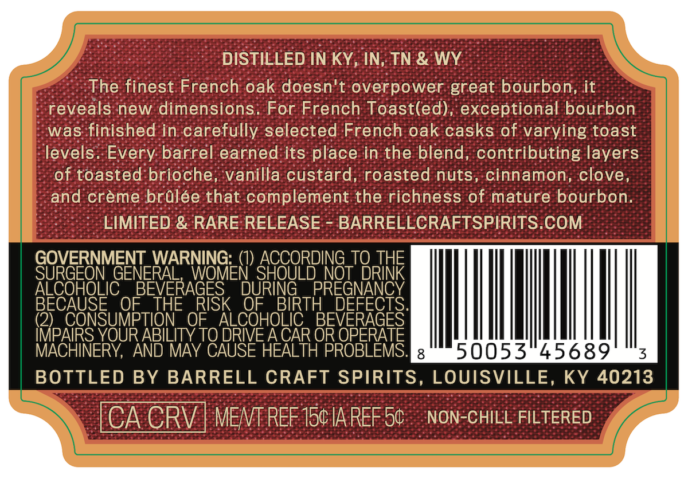
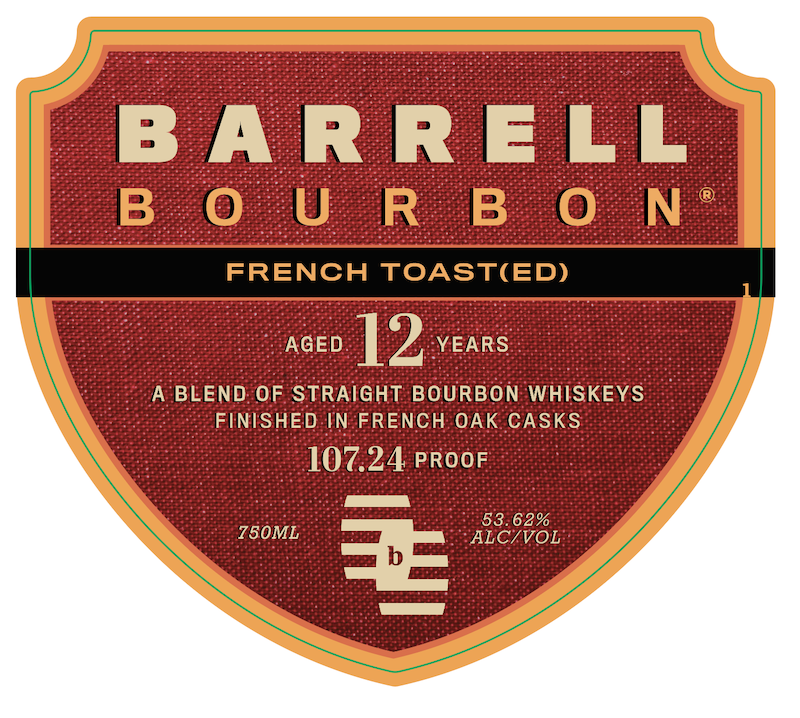
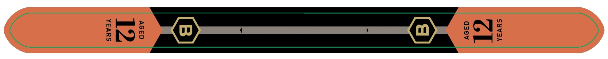

# TTB COLA Label Images - TTBID 26224001000606

**Brand Name:** BARRELL BOURBON

**Issue Date:** 08/24/2026

**Origin Code:** 22

**Product Class/Type:** 121

**Source:** [TTB Public COLA Registry](https://ttbonline.gov/colasonline/viewColaDetails.do?action=publicFormDisplay&ttbid=26224001000606)

## Label Images

### Back Label

### Front Label

### Label 3

## Extracted Label Text

*Text extracted via OCR - may contain errors*

*1 image(s) excluded: text did not meet readability threshold*

**Detected Proof:** 107.2
**Detected Age:** 12 Years

### Back Label

DISTILLED IN KY, IN, TN & WY
The finest French oak doesn't overpower great bourbon, it
reveals new dimensions
For French Toast(ed) , exceptional bourbon
was finished in carefully selected French oak casks of varying toast
levels. Every barrel earned its place in the blend, contributing layers
of toasted brioche, vanilla custard; roasted nuts, cinnamon, clove,
and creme brulee that complement the richness of mature bourbon:
LIMITED & RARE RELEASE
BARRELLCRAFTSPIRITS.COM
GOVERNMENT_WARNING:
ACCORDING
TSRHE
THE
SURGEON GENERAL,
WOMEN SHOULD NOT
ALCOHOLIC
BEVERAGES
DURING
PREGNANCY
BECAUSE
OF_
THE
RISK
OF
BIRTH
BEPEFEGES T
(2)_ CONSUMPTION
OF
ALCOHOLIC
IMPAIRS_YOUR ABILITY TO DRIVE ACAR OR OPERATE
MACHINERY
AND MAY CAUSE HEALTH PROBLEMS:
8
50053"45689
3
BOTTLED BY BARRELL CRAFT SPIRITS, LOUISVILLE, KY 40213
CA CRV
MENT REF 150 IA REF 5c
NON-CHILL FILTERED

### Front Label

B A R R ELL
B 0 U R B 0 N
FRENCH TOASTIED)
AGED
12
YEARS
A BLEND OF STRAIGHT BOURBON WHISKEYS
FINISHED IN FRENCH OAK CASKS
107.24 PROOF
53.62%
750ML
ALC/VOL
