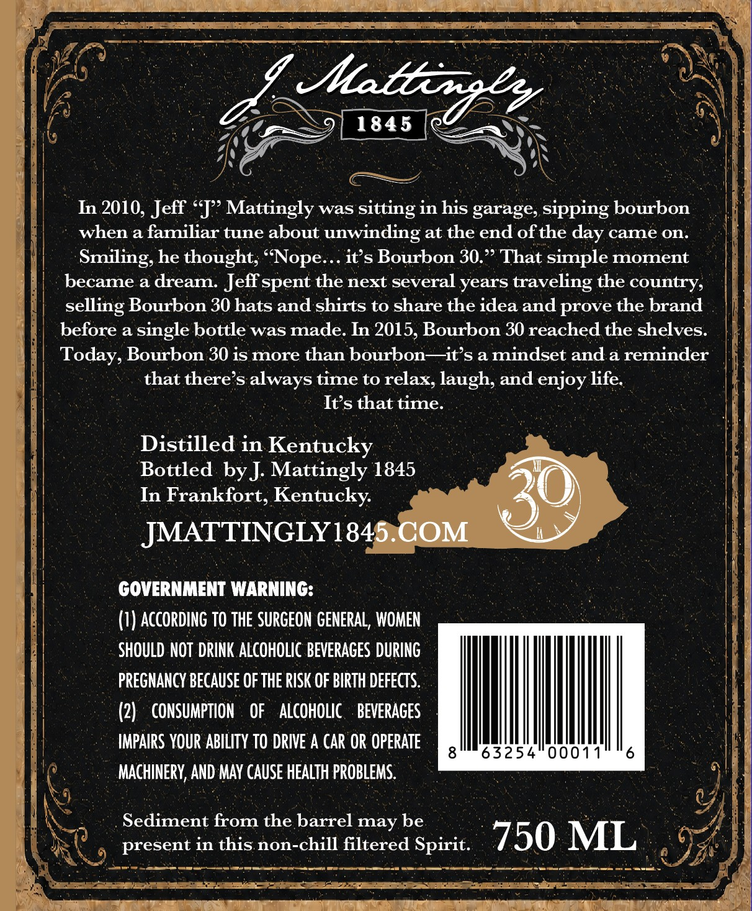
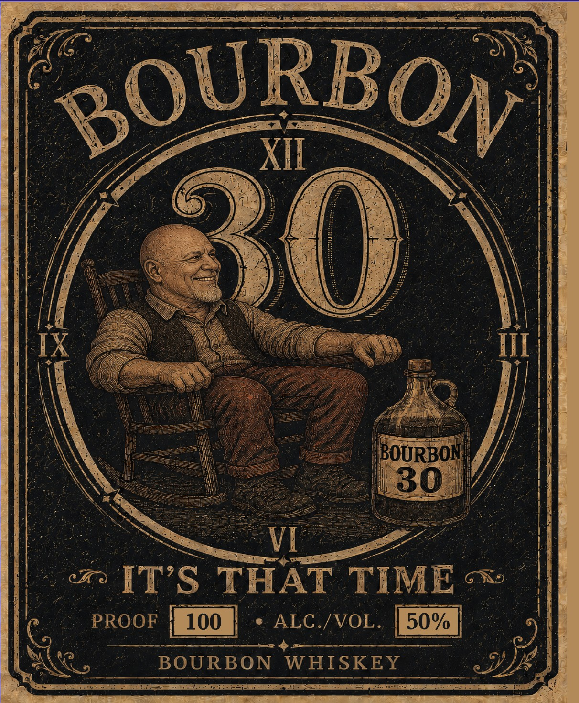

# TTB COLA Label Images - TTBID 26224001000671

**Brand Name:** BOURBON 30

**Fanciful Name:** BOURBON 30

**Issue Date:** 08/21/2026

**Origin Code:** 22

**Product Class/Type:** 141

**Source:** [TTB Public COLA Registry](https://ttbonline.gov/colasonline/viewColaDetails.do?action=publicFormDisplay&ttbid=26224001000671)

## Label Images

### Back Label

### Front Label

## Extracted Label Text

*Text extracted via OCR - may contain errors*

*1 image(s) excluded: text did not meet readability threshold*

### Back Label

Atateiney
1845
In 2010, Jeff <J  Mattingly was sitting in his garage; sipping bourbon
when a familiar tune about
unwinding at the end ofthe
came on:
Smiling; he thought;
it s Bourbon 30.'> That simple moment
became a dream:
Jeff spent the next several years
traveling the country;
selling Bourbon 30 hats and shirts to share the idea and prove the brand
before a
single bottle was made. In 2015, Bourbon 30 reached the shelves:
Today, Bourbon 30 is more than bourbon  it's a mindset and a reminder
that there s always time to relax, laugh, and enjoy life:
Its that time
Distilled in Kentucky
Bottled by J: Mattingly 1845
In Frankfort, Kentucky:
JMATTINGLY1845.COM
GOVERNMENT WARNING:
(1) AccORdInG TO THE SURGEON GENERAL, WOMEN
SHOULD NOT DRINK ALcOHOLIc BeVERAGES DURING
PREGNANCY BECAuSe OF THE RISK OF BIRTH DefECTs:
(2)   cONSUMPTION
OF
ALCOHOLIC
BEVERAGES
IMPAIRS YOUR AbILITY TO DRIVE A CAR OR OPERATE
8
63254
00011
6
MACHINERY; AND MAY CAUSe HEALTH prOBLEMS.
Sediment from the barrel may be
present in this non-chill filtered Spirit:
750 ML
day
(Nope:
