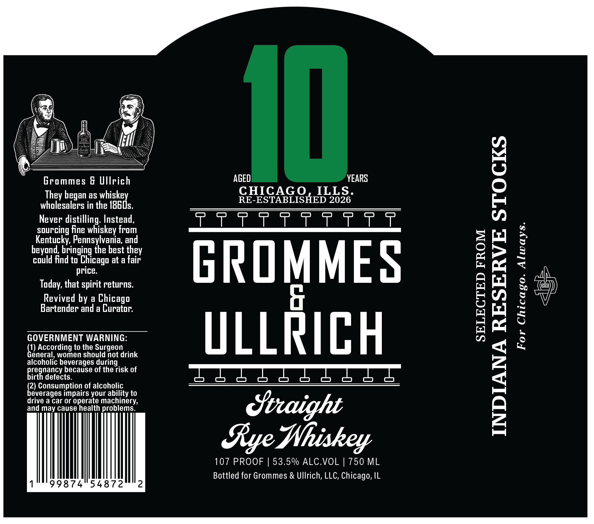
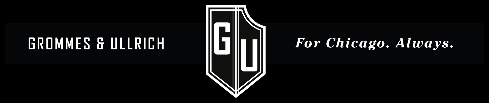

# TTB COLA Label Images - TTBID 26224001000696

**Brand Name:** GROMMES AND ULLRICH

**Issue Date:** 08/21/2026

**Origin Code:** 04

**Product Class/Type:** 102

**Source:** [TTB Public COLA Registry](https://ttbonline.gov/colasonline/viewColaDetails.do?action=publicFormDisplay&ttbid=26224001000696)

## Label Images

### Label 1

### Label 2

## Extracted Label Text

*Text extracted via OCR - may contain errors*

*1 image(s) excluded: text did not meet readability threshold*

**Detected Proof:** 107

### Label 1

Se

%

of

KS

———

I

Grommes & Ullrich

They began as whiskey

RE-ESTABLISHED 2026

CHICAGO, ILLS.

wholesalers in the 1860s.

Never distilling. Instead,

TTT TTT tt

sourcing fine whiskey from

Kentucky, Pennsylvania, and

= fx

beyond, bringing the best they

could find to Chicago at a fair

price.

Today, that spirit returns.

GROMMES

Revived by a Chicago

EY)

,

Bartender and a Curator.

GOVERNMENT WARNING:

g

1

eneral, women should not drink

) According to the Surgeon

ULLRICH

”

alcoholic beverages during

pre

nancy because of the risk of

birtl

fh

defects.

b

2

jeverages impairs your ability to

') Consumption of alcoholic

drive a car or operate machinery,

and may cause health problems.

Straight

Aye Nhiskey

107 PROOF | 53.5% ALC.VOL | 750 ML

Bottled for Grommes & Ullrich, LLC, Chicago, IL

99874 54872
