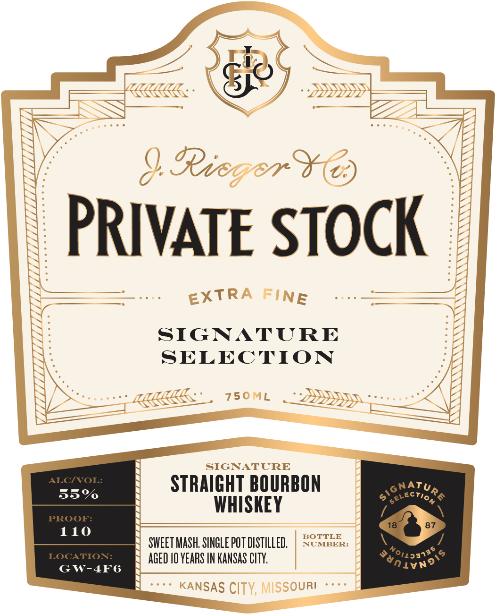
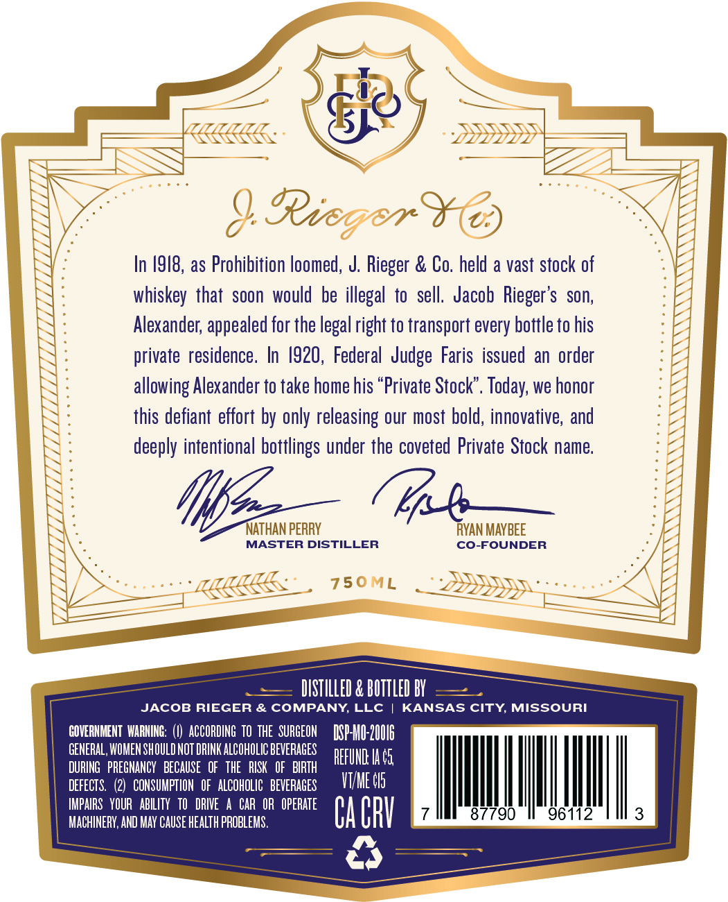

# TTB COLA Label Images - TTBID 26224001000778

**Brand Name:** J. RIEGER & CO. PRIVATE STOCK

**Fanciful Name:** STRAIGHT BOURBON WHISKEY

**Issue Date:** 08/21/2026

**Origin Code:** 29

**Product Class/Type:** 101

**Source:** [TTB Public COLA Registry](https://ttbonline.gov/colasonline/viewColaDetails.do?action=publicFormDisplay&ttbid=26224001000778)

## Label Images

### Label 1

### Label 2

### Label 3

## Extracted Label Text

*Text extracted via OCR - may contain errors*

**Detected Age:** 10 Years

### Label 1

Ti)

CEE:

TILL .

SF

» SSSHy

MAAS

(LI ddI hI de

Te

WS

9 Ree

aH 2)

PRIVATE STOCK

EXTRA

NE

=

=

SIGNATURE

SELECTION

s

MMA

750

L

DDD yr

“LQIS55

LLY,

=

SIGNATURE

STRAIGHT BOURBON

ATU

==o

oo’

CTI9

WHISKEY

110

SWEET MASH. SINGLE POT DISTILLED

NUMBER:

BOTTLE

AGED 10 YEARS IN KANSAS CITY.

oat?

GW-4F6

vn

KANSAS (]]

OURI

### Label 2

J. RIEGER & CO. + PRIVATE STOCK + O! SO GOOD + KANSAS CITY, MISSOURI

DS CASK FINISHED SELECTION KK:

IUNOSSIW ‘ALID SWSNVM © GOOD OS iO + NIOLS ALVAIHdM ¢ ‘OD FP YADA Ff

### Label 3

Ricger
In /918, as Prohibition loomed, J. Rieger & Co. held a vast stock of
whiskey that soon  would be illegal to sell.  Jacob Rieger's   son,
Alexander; appealed for the legal right to transport every bottle to his
private  residence. In /920, Federal  Judge Faris issued  an order
allowing Alexander to take home his "Private Stock". Today; we honor
this defiant effort by only releasing our most bold, innovative, and
deeply intentional bottlings under the coveted Private Stock name
NAThan PERRY
RVAN MAYBEE
MASTER DISTILLER
Co-FOUNDER
750ML
DISTILLED & BOTTLED BY
JACOB RIEGER & COMPANY, LLc
KANSAS CITY MISSOURI
GOVERHHENT WARHING:
ACCORDING TO THE  SURGEON
DSP-HIO 20U16
GENERAL, WOMEN SHOULD NOT DRINK ALCOHOLIC BEVERAGES
REFUHD Ia 45
DURING   PREGNANCY   BECAUSE   OF   ThE   RISK   OF   BIRTH
DEFECTS.
2)  CONSUMPTION   OF   ALCOHOLIC   BEVERAGES
VTME 05
IMPAIRS   YOUR   ABILITY   TO   DRIVE
CAR OR   OPERATE
MACHINERY; AND MAY CAUSE HeaLTh PROBLEMS.
Ca CRV
87790
96112
3
